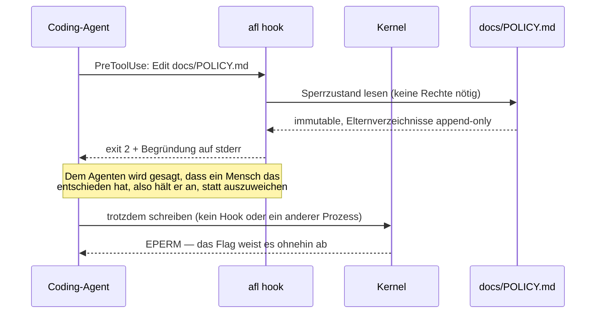
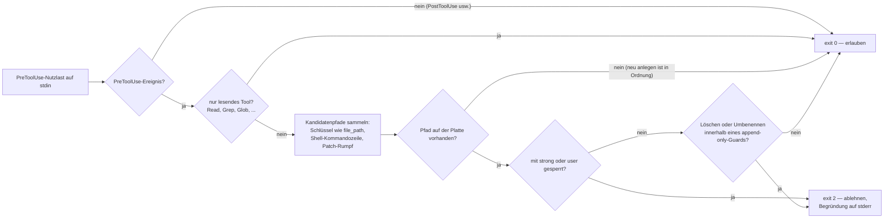
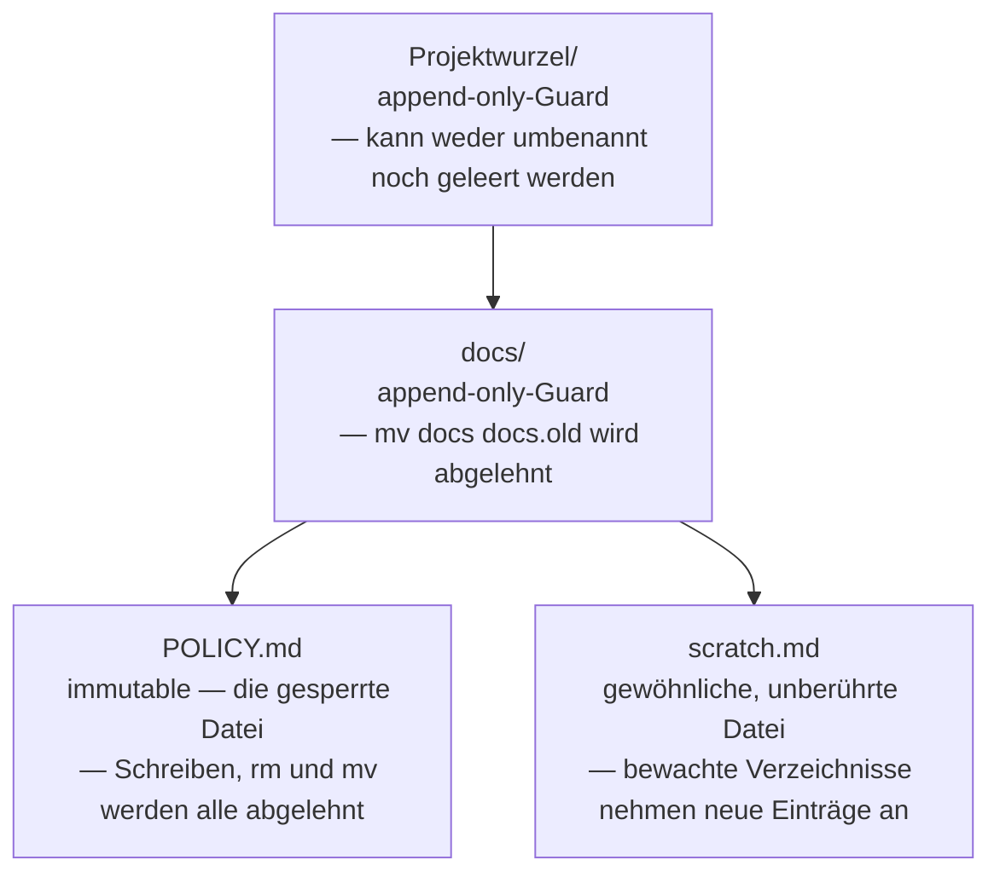

<p align="center">
  
</p>

<p align="center">
  <a href="README.md">English</a> ·
  <a href="README.ko.md">한국어</a> ·
  <a href="README.zh.md">中文</a> ·
  <a href="README.ja.md">日本語</a> ·
  <b>Deutsch</b> ·
  <a href="README.fr.md">Français</a>
</p>

# agent-file-lock (`afl`)

## Warum es dieses Werkzeug gibt

Manche Dokumente in einem Repository sind gar keine Dokumente. Es sind
Entscheidungen: einmal ausdiskutiert, abgesegnet und danach bewusst in Ruhe
gelassen. In unserem Team gab es ein paar davon. Alle wussten, welche das waren,
und monatelang hatte sie niemand angefasst.

Dann fasste ein Agent eines davon an. Er sollte ein Verzeichnis aufräumen, und
er machte seine Arbeit gut: Er formulierte eine Überschrift um, straffte einen
Absatz und strich eine Zeile, die wie ein Überbleibsel aussah. Jede einzelne
Änderung war für sich genommen vertretbar. Zusammen schrieben sie still eine
Regel um, die ein Mensch mit Absicht dort hingeschrieben hatte, und das Diff lag
eine Weile in einem Branch, bevor jemand genau genug hinsah, um es zu bemerken.

Das Unangenehme daran war, dass nichts schiefgegangen war. Der Agent hat keine
Regel gebrochen, weil es keine Regel gab, die er hätte sehen können. Ein Hinweis
im Contributing-Leitfaden ist eine Bitte. Eine Zeile in `CLAUDE.md` ist eine
Bitte. `chmod a-w` ist kaum mehr als das: Der nächste Tool-Aufruf läuft unter
demselben Benutzer und kann es rückgängig machen, ohne das je zu melden. Alles,
was wir hatten, war ein Ratschlag, und ein Ratschlag ist genau das, was von etwas
wegoptimiert wird, das hilfreich sein will.

Die Garantie musste also von einer Stelle kommen, an die der Agent nicht
heranreicht, und sie musste mit einer Erklärung kommen. Das ist die ganze Idee
hinter diesem Werkzeug: die Datei außer Reichweite von allem bringen, was unter
deinem Benutzer läuft, und dann, wenn trotzdem jemand danach greift, mit einem
Satz antworten, den ein Mensch geschrieben hätte, statt mit einer Zahl, die der
Kernel sich notgedrungen ausdenken musste.

## Was es tut

`afl` fixiert Dateien, die ein Coding-Agent (oder sonst jemand, der unter deinem
Benutzer läuft) niemals verändern darf. Es nutzt das **Immutable-Flag** des
Kernels — unter Linux `chattr +i`, unter macOS `chflags schg` —, sodass sich die
Sperre ohne root nicht aufheben lässt, anders als bei `chmod`, das derselbe
Benutzer einfach zurücknehmen kann. Gesperrte Dateien lassen sich außerdem weder
löschen noch umbenennen, womit auch der bei Editoren und Agenten beliebte Trick
„erst in eine temporäre Datei schreiben, dann umbenennen“ ins Leere läuft.

Es schließt auch den Weg *um* die Sperre herum. Eine gesperrte Datei, deren
übergeordnetes Verzeichnis umbenannt werden kann, ist nicht wirklich geschützt:
`mv docs docs.locked && mkdir docs` lässt die unveränderliche Inode unangetastet
und sorgt dafür, dass der Pfad auf eine frische, beschreibbare Datei zeigt.
Deshalb markiert `afl lock` zusätzlich jedes übergeordnete Verzeichnis bis hinauf
zur Projektwurzel als **append-only**: Neue Dateien dürfen dort weiterhin
entstehen, aber nichts Bestehendes kann gelöscht oder umbenannt werden — die
Verzeichnisse selbst eingeschlossen. Siehe [Eltern-Guards](#eltern-guards).

Und es erklärt sich selbst. Der Kernel kann nur `EPERM` antworten; ein Agent, der
„Operation not permitted“ liest, erfährt, dass ein Schreibzugriff fehlgeschlagen
ist, nicht aber, dass ein Mensch entschieden hat, dass er nicht stattfinden soll
— und genau so entsteht der oben beschriebene Umweg. `afl hook` läuft vor dem
Tool-Aufruf und weist ihn mit Worten zurück. Siehe
[Dem Agenten das Warum sagen](#dem-agenten-das-warum-sagen).

Eine einzelne statische Go-Binärdatei. Keine Laufzeitabhängigkeiten (nur die
Standardbibliothek).

| Stufe | Mechanismus | Kann derselbe Benutzer es aufheben? | Verhindert Löschen/Umbenennen? |
|---|---|---|---|
| `strong` (Standard) | Linux `FS_IMMUTABLE_FL`, macOS `SF_IMMUTABLE` | **Nein** (nur root) | **Ja** |
| `user` | `chmod a-w` (+ macOS `UF_IMMUTABLE`) | Ja | Nein (Linux) / Ja (macOS) |
| Eltern-Guard | Linux `FS_APPEND_FL`, macOS `SF_APPEND` | **Nein** (nur root) | **Ja** (Hinzufügen bleibt erlaubt) |

## Installation

**Linux und macOS — die Release-Binärdatei für diesen Rechner herunterladen**

```sh
curl -fsSL https://raw.githubusercontent.com/Mineru98/agent-file-lock/main/install.sh | sh
```

**macOS — Homebrew-Cask (installiert auch die Shell-Vervollständigungen)**

```sh
brew install Mineru98/tap/afl
```

**Jede Plattform mit einer Go-Toolchain**

```sh
go install github.com/Mineru98/agent-file-lock/cmd/afl@latest
```

**Aus dem Quelltext**

```sh
make build && cp bin/afl /usr/local/bin/
```

[`install.sh`](install.sh) wählt das Tarball für dein Betriebssystem und deine
Architektur, prüft es gegen die `checksums.txt` des Releases und installiert
`afl` nach `/usr/local/bin` — und greift nur dann zu `sudo`, wenn dieses
Verzeichnis es wirklich verlangt. Es liest drei Variablen: `AFL_VERSION` für ein
bestimmtes Tag, `AFL_BIN_DIR` für einen anderen Ablageort der Binärdatei und
`AFL_NO_SUDO=1`, damit es lieber fehlschlägt als Rechte auszuweiten.

```sh
# erst lesen, bevor du es in eine Shell pipest, dann Version und Ort festnageln
curl -fsSL https://raw.githubusercontent.com/Mineru98/agent-file-lock/main/install.sh -o install.sh
AFL_VERSION=v0.1.5 AFL_BIN_DIR="$HOME/.local/bin" sh install.sh
```

Vorgebaute Tarballs für linux/amd64, linux/arm64, darwin/amd64 und darwin/arm64
hängen an jedem [Release](https://github.com/Mineru98/agent-file-lock/releases).
Wenn du gar kein Skript ausführen möchtest, funktioniert auch
`curl -fsSL <asset-url> | tar xzf - afl`.

## Aktualisieren

Aktualisiere so, wie du installiert hast — jeder der folgenden Befehle ersetzt
die Binärdatei an Ort und Stelle. Sonst ist nichts noch einmal zu tun: Die
Hook-Konfiguration ruft `afl` über den Namen aus deinem `PATH` auf, und Sperren
sind Kernel-Flags an den Dateien selbst; beides übersteht den Austausch
unverändert.

**Linux und macOS — das Installationsskript**

```sh
# derselbe Befehl wie bei der Installation; er überschreibt die vorhandene Binärdatei
curl -fsSL https://raw.githubusercontent.com/Mineru98/agent-file-lock/main/install.sh | sh
```

**macOS — Homebrew-Cask**

```sh
brew update && brew upgrade --cask Mineru98/tap/afl
```

**Jede Plattform mit einer Go-Toolchain**

```sh
go install github.com/Mineru98/agent-file-lock/cmd/afl@latest
```

**Aus dem Quelltext**

```sh
git pull && make build && cp bin/afl /usr/local/bin/
```

Prüfe danach, welchen Build du gerade verwendest, und gehe über ein festgenageltes
Tag zurück, falls sich ein Release als schlechter erweist als das, das es ersetzt
hat:

```sh
afl version
curl -fsSL https://raw.githubusercontent.com/Mineru98/agent-file-lock/main/install.sh | AFL_VERSION=v0.1.4 sh
```

## Wie es funktioniert

Zwei Schichten, und sie versagen in entgegengesetzte Richtungen. Das Kernel-Flag
ist das, was den Schreibzugriff tatsächlich stoppt; der Hook ist das, was ihn
erklärt. Jede allein lässt eine Lücke: ein Flag ohne Erklärung lädt zum Umweg
ein, und eine Erklärung ohne Flag ist nur ein Vorschlag.



`afl hook` liest die Nutzlast der Harness von stdin, ermittelt jeden Pfad, den der
Tool-Aufruf anlegen, überschreiben, verschieben oder löschen würde, und antwortet,
bevor der Syscall passiert. Es schreibt nie etwas und braucht keine Rechte.



Eine Datei zu sperren markiert auch ihre übergeordneten Verzeichnisse, und genau
das schließt den Umweg über das Umbenennen des Elternverzeichnisses. Bewachte
Verzeichnisse nehmen weiterhin neue Einträge auf, der Baum bleibt also benutzbar:



## Schnellstart

Schreibe die Datei zuerst und sperre sie danach. Das Kernel-Flag macht die Datei
für alle unbeschreibbar, dich eingeschlossen; eine Datei, die noch leer gesperrt
wurde, muss also erst wieder entsperrt werden, bevor sie gefüllt werden kann.

```sh
mkdir -p docs
cat > docs/POLICY.md <<'EOF'
# Policy

Never commit credentials to this repository.
EOF

sudo afl lock docs/POLICY.md
```

Die Datei ist jetzt unveränderlich, und jedes Verzeichnis bis zur Projektwurzel
ist append-only, sodass der Pfad auch nicht unter der Sperre hinweg ausgetauscht
werden kann:

```sh
echo x >> docs/POLICY.md      # → Operation not permitted
rm docs/POLICY.md             # → Operation not permitted (auch mit sudo, bis entsperrt wird)
mv docs docs.old              # → Operation not permitted (der Eltern-Guard)
touch docs/scratch.md         # → in Ordnung; bewachte Eltern nehmen neue Dateien weiterhin an
```

Installiere dann den Hook. **Überspringe diesen Schritt nicht, wenn in diesem
Repository ein Agent arbeitet.** Vor dem Ausführen wird nichts registriert, und
ein Agent, der sich nur auf den Kernel stützen kann, liest
`Operation not permitted` als kaputtes Werkzeug statt als Entscheidung eines
Menschen — und genau dann beginnt er, nach einem Weg drumherum zu suchen. Jeder
Agent liest seine eigene Konfigurationsdatei, installiere also die, die du
tatsächlich verwendest:

```sh
afl hook install claude         # Claude Code — .claude/settings.json
afl hook install codex          # Codex      — .codex/hooks.json
afl hook install --all          # beide
```

Bevor überhaupt etwas geschrieben wird, fragt es, wohin der Hook gehört, denn die
beiden Antworten schützen Unterschiedliches: Der Projekt-Geltungsbereich deckt
dieses Repository ab, der Benutzer-Geltungsbereich jedes Repository, das du
öffnest. Enter wählt das Projekt.

```
$ afl hook install claude
Where should the claude hook be installed?
  1) this project — /home/me/project/.claude/settings.json   (default)
  2) your user    — ~/.claude/settings.json, and every other repository
scope [1/2] (default 1):
[claude]       installed (/home/me/project/.claude/settings.json)

The hook refuses edits to locked paths before the tool runs and tells the
agent why. It needs no privileges. Verify with: afl hook check <locked path>
```

Mit `--project` oder `--user` (`--global` ist dasselbe Flag) antwortest du vorab,
was auch ein Skript braucht: Ein stdin, das kein Terminal ist, wird nie gefragt und
bekommt den Projekt-Geltungsbereich. Die Installation braucht kein root und führt
nur mit dem zusammen, was die Datei bereits enthält. Prüfe, dass es gewirkt hat:

```sh
afl hook check docs/POLICY.md   # exit 2, und die Ablehnung im Klartext
```

Die Datei wieder freigeben:

```sh
sudo afl unlock docs/POLICY.md
```

## Verwendung

```
afl lock   <path>...                  lock files + guard their parents (needs sudo for strong)
afl lock   -R <dir>                   every regular file beneath <dir>
afl lock   -f afl.yaml                everything listed in the config
afl unlock <path>... | -R <dir> | -f afl.yaml
afl status                            no path: scan this tree and list what is locked
afl status [-R] <path>... | -f afl.yaml
afl check  -f afl.yaml                exit 1 if anything drifted (CI / pre-commit; no root)
afl run    -f afl.yaml -- <cmd...>    unlock, run <cmd>, then always re-lock
afl hook                              PreToolUse guard for agents (stdin JSON, exit 2 = refused)
afl hook install claude|codex|--all   register the hook (asks: --project or --user)
afl hook check <path>...              the same verdict from any script (no root)
afl hook print claude|codex           the config snippet for that agent
afl doctor [<path>]                   OS, privileges, filesystem support, WSL detection
afl completion bash|zsh|fish
```

`afl status` ohne Argumente beantwortet die Frage, die du wirklich hast — was ist
hier eigentlich gesperrt? —, indem es den Baum ab dem Arbeitsverzeichnis
durchgeht. Es liest nur, braucht also keine Rechte, und es überspringt `.git`,
`node_modules` und die anderen Verzeichnisse, die ein Repository groß machen, aber
nie eine Sperre tragen (`-a` bezieht sie ein, `--depth <n>` begrenzt den Lauf).

```
$ afl status
strong    docs/POLICY.md
guard     .
guard     docs/

1 locked, 2 guarded parents (412 files, 37 directories scanned under /home/me/project)
an agent is refused with: "The user has NOT authorized this agent to modify this file."
details: afl status <path>   ·   the full refusal: afl hook check <path>
```

Flags: `-f/--config`, `-R/--recursive`, `--include-dirs`, `--dir-only`,
`--level strong|user`, `--exclude <glob>` (wiederholbar, `**` wird unterstützt),
`--follow-symlinks`, `-n/--dry-run`, `--fail-fast`, `--json`, `-q/--quiet`,
`--elevate` (erneutes Ausführen über sudo), `--no-guard-parents`,
`--guard-root <dir>`, und für `status`: `-a/--all`, `--depth <n>`.

Regeln, die man kennen sollte:

- Ein Verzeichnis braucht `-R` (oder `--dir-only`); `afl lock docs` allein wird mit einem Hinweis abgelehnt.
- `-R` erfasst nur reguläre Dateien. Mit `--include-dirs` werden auch Verzeichnis-Inodes gesperrt, was zusätzlich das Anlegen neuer Dateien darin verhindert.
- Symlinks werden übersprungen, sofern nicht `--follow-symlinks` gesetzt ist.
- Jede Änderung wird erneut gelesen und überprüft; ein Dateisystem, das das Flag stillschweigend ignoriert, wird als Fehlschlag gemeldet.
- Bereits gesperrte bzw. bereits entsperrte Ziele sind No-ops (exit 0).
- Mussten alle angeforderten Einträge übersprungen werden (etwa weil eine geschützte Datei durch einen Symlink ersetzt wurde), endet `lock` mit exit 1, und `check` meldet Drift statt eines hohlen Erfolgs.
- `unlock` nach einer Sperre der Stufe `user` stellt nur `u+w` wieder her; die beim Sperren entfernten Schreibbits für Gruppe und andere kommen nicht zurück (afl merkt sich den ursprünglichen Modus nicht).
- Alle Änderungen laufen über einen mit `O_NOFOLLOW` geöffneten Dateideskriptor, sodass die letzte Pfadkomponente zwischen Prüfung und Änderung nicht gegen einen Symlink getauscht werden kann.

Exit-Codes: `0` ok · `1` teilweiser Fehlschlag oder Drift bei `check` ·
`2` Aufruffehler · `3` unzureichende Rechte · `4` nicht unterstütztes Dateisystem.

## Eltern-Guards

`docs/SSOT.md` zu sperren und es dabei zu belassen, schützt eine *Inode*, keinen
*Pfad*. Das darüberliegende Verzeichnis kann umbenannt und an seiner Stelle eine
neue `docs/SSOT.md` angelegt werden — die Sperre ist weiterhin intakt und völlig
belanglos.

Deshalb geht `afl lock` von jeder gesperrten Datei nach oben und setzt auf jedem
Verzeichnis bis zur Projektwurzel das **Append-only-Flag** (`chattr +a` unter
Linux, `chflags sappnd` unter macOS). Der Kernel verweigert dann für diese
Verzeichnisse:

- das Löschen oder Umbenennen von allem, was bereits darin liegt (sowohl
  `may_delete()` unter Linux als auch `ufs_rename()` unter BSD prüfen das Flag), und
- das Umbenennen des Verzeichnisses selbst, weil die betroffene Inode append-only
  ist.

Neue Einträge anzulegen bleibt erlaubt, und genau das macht die Sache brauchbar:
Der Agent darf überall Dateien hinzufügen, er kann nur nichts Bestehendes zum
Verschwinden bringen. Wie beim Immutable-Flag braucht das Aufheben root.

```
project/            ← append-only        mv project elsewhere   → refused
├── docs/           ← append-only        mv docs docs.old       → refused
│   └── SSOT.md     ← immutable          write / rm / mv        → refused
└── src/            (untouched)          anything               → fine
```

- Die Grenze ist das Verzeichnis, in dem `-f <config>` liegt, sonst die Wurzel des Git-Worktrees, sonst das eigene Elternverzeichnis des Ziels. `--guard-root <dir>` überschreibt sie; `/`, `$HOME` und Verzeichnisse der obersten Ebene werden abgelehnt.
- `--no-guard-parents` schaltet das ab und öffnet den Umweg wieder.
- `afl unlock` gibt einen Guard erst frei, wenn darunter nichts mehr gesperrt ist; das Entsperren einer Datei entwaffnet also nie den Schutz ihrer Geschwister.
- Der Preis ist real und sollte bekannt sein: Solange ein Guard steht, kann *kein* Eintrag in diesen Verzeichnissen gelöscht oder umbenannt werden. `rm -rf project` schlägt fehl, und ein `git checkout`, das eine Datei der obersten Ebene über Tempdatei-plus-Umbenennen ersetzt, ebenfalls. `sudo afl run -f afl.yaml -- git pull` fängt das ab (es gibt die Guards für die Dauer des Befehls frei), und `--guard-root` verkleinert den Wirkungsradius.
- Linux kennt kein vom Benutzer aufhebbares Append-Flag, daher bewacht `--level user` Elternverzeichnisse nur unter macOS/BSD; dort wird es gemeldet und übersprungen.

## Dem Agenten das Warum sagen

Einem Agenten, der von seinem Editier-Tool `EPERM` bekommt, wurde gesagt, dass ein
Schreibzugriff fehlgeschlagen ist. Ihm wurde nicht gesagt, dass ein Mensch
entschieden hat, dass er nicht stattfinden darf, und dieser Unterschied trennt
„das Hindernis melden“ von „einen Weg um das Hindernis herum suchen“.

`afl hook` ist ein PreToolUse-Guard: Er liest den Tool-Aufruf, bevor er läuft, und
weist diejenigen zurück, die einen gesperrten Pfad ändern, verschieben oder löschen
würden — mit einer Meldung, die sagt, wer es verboten hat und was stattdessen zu
tun ist.

```
$ afl hook check docs/SSOT.md
BLOCKED by agent-file-lock (afl)

The user has NOT authorized this agent to modify this file.

  docs/SSOT.md — locked by the user (level: strong, attempted: modify)

These paths are locked at the kernel level (macOS schg / Linux chattr +i)
and their parent directories are append-only, so the usual workarounds are
closed too and are treated as a violation of the user's instruction:
  - renaming or replacing a parent directory to recreate the path
  - writing the content to a different path and calling it done
  - clearing the flag with chflags / chattr / sudo

If the change is genuinely required, stop and ask the user to unlock it:
  sudo afl --help        # then, once the user agrees:
  sudo afl unlock <path>
```

```sh
afl hook install claude         # fragt: dieses Projekt oder dein Benutzer?
afl hook install claude --project
afl hook install claude --user  # = --global; ~/.claude/settings.json
afl hook install --all          # claude + codex, eine Frage für beide
afl hook uninstall --all
```

Er braucht keine Rechte und ist die zweite Verteidigungslinie, nicht die erste:
Den Schreibzugriff weist der Kernel so oder so ab. Was der Hook hinzufügt, ist der
Grund.

**Welche Agenten.** Claude Code hat dieses Hook-Protokoll definiert und Codex hat
es unverändert übernommen, eine Binärdatei bedient also beide.
`afl hook install claude` schreibt `.claude/settings.json`,
`afl hook install codex` schreibt `.codex/hooks.json`; beide führen mit dem
zusammen, was schon da ist, und beide lassen sich mit `hook uninstall` entfernen.
Diese beiden Namen sind die vollständige Liste, die `hook install` und
`hook print` annehmen. Jede andere Harness, die vor einem Tool-Aufruf einen Befehl
ausführen kann, wird von Hand gegen diesen Vertrag angebunden:

| | |
|---|---|
| Befehl | `afl hook [--format auto\|json\|exit-code] [--strict] [<path>...]` |
| stdin | der Tool-Aufruf als JSON — optional |
| Exit | `0` erlauben, `2` ablehnen; bei Erlaubnis wird nichts ausgegeben |
| stderr | bei Ablehnung die Begründung als Klartext |
| stdout | bei Ablehnung ein JSON-Objekt mit der Begründung, gleichzeitig unter `hookSpecificOutput.permissionDecision`, `decision`/`reason` und `systemMessage`, sodass mehrere Protokolle mit einer Antwort bedient werden |

Verwende `--format json`, wenn die Harness einen Exit-Code ungleich null als
kaputten Hook behandelt, und `--format exit-code`, wenn sie nur den Exit-Status
liest. Pfade dürfen als Argumente übergeben werden, wenn die Harness kein JSON
pipen kann — genau das ist `afl hook check`, und genau das macht es aus einem
Git-pre-commit-Hook heraus benutzbar.

**Worauf es schaut.** `tool_name`, `tool_input` und `cwd`, dazu — an beliebiger
Stelle der Nutzlast — Schlüssel wie `file_path` / `path` / `target_file` /
`source` / `destination`, jede `command`-Zeichenkette (als Shell-Kommandozeile
tokenisiert, sodass `mv`, `rm`, `cp`, `tee`, `sed -i`, `git checkout`,
Umleitungen und `sudo chflags` alle erkannt werden) sowie jeder Patch- oder
Unified-Diff-Rumpf (`*** Update File:`, `+++ b/...`). Nur lesende Tools und
Befehle werden kommentarlos erlaubt. Ein Befehl, den es nicht einordnen kann,
bleibt dem Kernel überlassen, sofern du nicht `--strict` übergibst, und eine
nicht parsbare Nutzlast blockiert nie — ein Hook, der bei fehlerhafter Eingabe
zusperrt, würde die Harness unbenutzbar machen.

## Konfigurationsdatei

`afl.yaml` (oder `afl.json` mit demselben Schema). Relative Pfade werden gegen das
Verzeichnis der Datei aufgelöst.

```yaml
version: 1
level: strong
exclude:
  - "**/*.tmp"
paths:
  - docs/POLICY.md
  - path: docs/specs
    recursive: true
    include_dirs: false
  - path: README.md
    level: user
```

Der YAML-Parser ist bewusst eine Teilmenge (Mappings, Sequenzen, quotierte und
unquotierte Skalare, Kommentare). Anker, Flow-Stil (`{}`/`[]`), Block-Skalare
(`|`/`>`) und Tags werden mit Zeilennummer abgelehnt — nimm JSON, wenn du sie
brauchst. Siehe [`afl.yaml.example`](afl.yaml.example).

## Zusammenspiel mit git

Gesperrte Dateien, die git verfolgt, lassen `git pull` / `checkout`
fehlschlagen, wenn sie stromaufwärts geändert werden. Das ist der Sinn der Sache.
Zum Aktualisieren:

```sh
sudo afl run -f afl.yaml -- git pull
```

`afl run` entsperrt die geschützte Menge **und gibt die Eltern-Guards frei**,
führt den Befehl aus und stellt danach beides wieder her, egal wie der Befehl
endet (sein Exit-Code wird durchgereicht; ein fehlgeschlagenes erneutes Sperren
macht daraus exit 1 mit einer lauten Warnung). Unter `sudo` läuft der Befehl als
der aufrufende Benutzer (`SUDO_UID`/`SUDO_GID`), damit `git pull` oder ein Editor
keine root-eigenen Dateien anlegt; mit `--as-root` bleibt es bei root. Die manuelle
Form funktioniert weiterhin, falls du sie bevorzugst:

```sh
sudo afl unlock -f afl.yaml && git pull && sudo afl lock -f afl.yaml
```

Pre-commit / CI: `afl check -f afl.yaml` braucht kein root und endet bei Drift mit
exit 1, und `afl hook check <path>...` liefert dasselbe Urteil für einzelne Pfade.

## Plattformhinweise

**Linux** — braucht `CAP_LINUX_IMMUTABLE` sowohl für das Immutable-Flag als auch
für den Append-only-Eltern-Guard (root hat es; Dockers Standard-Capability-Satz
hat es **nicht**: `docker run --cap-add LINUX_IMMUTABLE`). Unterstützt auf
ext2/3/4, xfs, btrfs, f2fs, jfs. Nicht auf NFS, SMB, FAT/exFAT, overlayfs, FUSE
oder 9p. `afl doctor` liest `/proc/self/mountinfo` und sagt es dir, bevor irgendetwas
angefasst wird.

**macOS** — `strong` = `schg`, root ist zum Setzen und Aufheben nötig. `user`
ergänzt `uchg`. Eltern-Guards sind `sappnd` (root) bzw. `uappnd` bei
`--level user`.

**WSL** — WSL2s eigenes Dateisystem (ext4, z. B. unter `~`) verhält sich wie
Linux. `/mnt/c` und andere DrvFs-Mounts sind 9p und können das Flag nicht halten;
`afl` endet dann mit exit 4 und sagt dir, dass du die Dateien ins Linux-Dateisystem
verschieben sollst (oder auf `--level user` ausweichst, was auf DrvFs nur mit
aktiviertem `metadata` in `/etc/wsl.conf` funktioniert).

**Natives Windows** liegt außerhalb des Rahmens.

## Shell-Vervollständigung

```sh
# bash (kompatibel ab 3.2)
afl completion bash > ~/.local/share/bash-completion/completions/afl
# zsh
afl completion zsh > "${fpath[1]}/_afl"        # z. B. /usr/local/share/zsh/site-functions/_afl
# fish
afl completion fish > ~/.config/fish/completions/afl.fish
```

Homebrew: `$(brew --prefix)/etc/bash_completion.d/afl`,
`$(brew --prefix)/share/zsh/site-functions/_afl`.

Hinweis: Das Präfix `afl` teilt es sich mit dem AFL-Fuzzer (`afl-fuzz`,
`afl-gcc`). Sie kollidieren nicht, aber `afl<TAB>` listet beide auf, wenn du ihn
installiert hast.

## Lizenz

MIT
