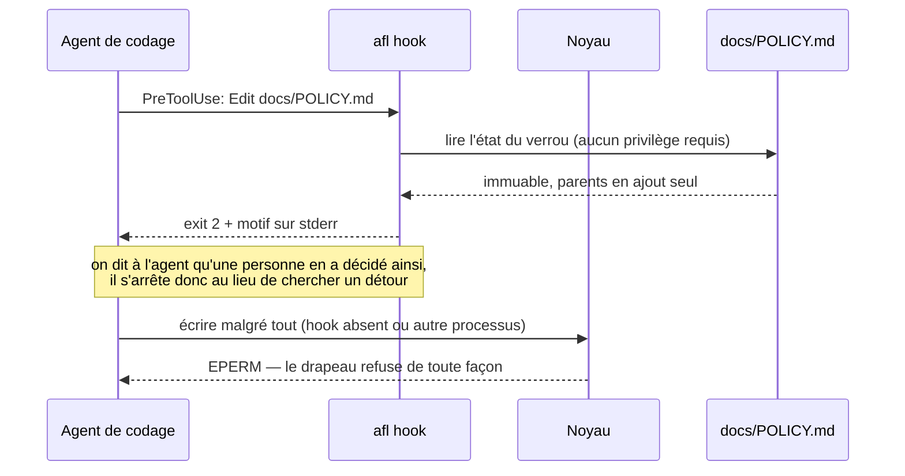
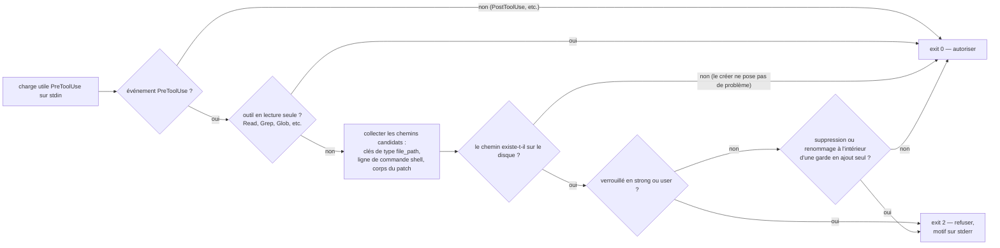
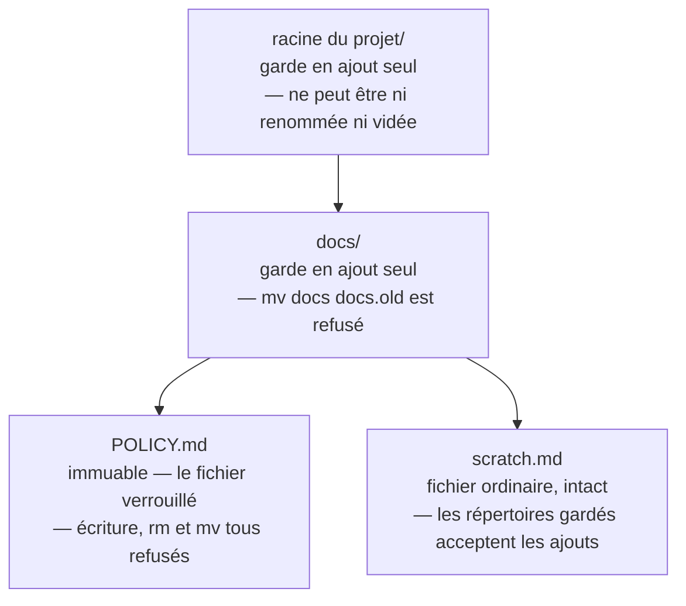

<p align="center">
  
</p>

<p align="center">
  <a href="README.md">English</a> ·
  <a href="README.ko.md">한국어</a> ·
  <a href="README.zh.md">中文</a> ·
  <a href="README.ja.md">日本語</a> ·
  <a href="README.de.md">Deutsch</a> ·
  <b>Français</b>
</p>

# agent-file-lock (`afl`)

## Pourquoi cet outil existe

Certains documents d'un dépôt ne sont pas vraiment des documents. Ce sont des
décisions : discutées une fois, validées, puis délibérément laissées
tranquilles. Notre équipe en avait quelques-unes. Tout le monde savait
lesquelles, et personne n'y avait touché depuis des mois.

Puis un agent en a modifié une. On lui avait demandé de ranger un répertoire, et
il a bien fait son travail : il a reformulé un titre, resserré un paragraphe,
supprimé une ligne qui ressemblait à un reliquat. Prise isolément, chaque
modification se défendait. Ensemble, elles ont discrètement réécrit une règle
qu'une personne avait posée à dessein, et le diff est resté un moment dans une
branche avant que quelqu'un ne regarde d'assez près pour s'en apercevoir.

Le plus dérangeant, c'est que rien n'avait mal tourné. L'agent n'a enfreint
aucune règle, parce qu'il n'y avait aucune règle qu'il puisse voir. Une note dans
le guide de contribution est une demande. Une ligne dans `CLAUDE.md` est une
demande. `chmod a-w` est à peine mieux : l'appel d'outil suivant s'exécute sous
le même utilisateur et peut l'annuler sans jamais le signaler. Tout ce que nous
avions relevait du conseil, et le conseil est précisément ce qu'une chose
cherchant à être utile optimise en premier.

La garantie devait donc venir d'un endroit hors de portée de l'agent, et elle
devait s'accompagner d'une explication. Toute l'idée de cet outil est là : mettre
le fichier hors d'atteinte de tout ce qui s'exécute sous votre compte, puis,
lorsque quelque chose y porte quand même la main, répondre par une phrase qu'une
personne aurait écrite plutôt que par un code que le noyau a bien dû inventer.

## Ce qu'il fait

`afl` épingle les fichiers qu'un agent de codage (ou quiconque s'exécutant sous
votre compte) ne doit jamais modifier. Il s'appuie sur le **drapeau immuable** du
noyau — `chattr +i` sous Linux, `chflags schg` sous macOS —, si bien que le
verrou ne peut pas être levé sans root, contrairement à `chmod`, que le même
utilisateur peut simplement défaire. Les fichiers verrouillés ne peuvent pas non
plus être supprimés ni renommés, ce qui met en échec l'astuce du « fichier
temporaire puis renommage » chère aux éditeurs et aux agents.

Il ferme aussi le chemin qui *contourne* le verrou. Un fichier verrouillé dont le
répertoire parent peut être renommé n'est pas réellement protégé :
`mv docs docs.locked && mkdir docs` laisse l'inode immuable intact et fait
pointer le chemin vers un fichier neuf et inscriptible. `afl lock` marque donc
aussi chaque répertoire parent, jusqu'à la racine du projet, en **ajout seul
(append-only)** : de nouveaux fichiers peuvent toujours y être créés, mais rien
d'existant ne peut être supprimé ni renommé, les répertoires eux-mêmes compris.
Voir [Gardes de répertoires parents](#gardes-de-répertoires-parents).

Et il s'explique. Le noyau ne peut répondre que `EPERM` ; un agent qui lit
« Operation not permitted » apprend qu'une écriture a échoué, non qu'un humain a
décidé qu'elle ne devait pas avoir lieu — et c'est ainsi que naît le contournement
décrit plus haut. `afl hook` s'exécute avant l'appel d'outil et le refuse avec des
mots. Voir [Expliquer le refus à l'agent](#expliquer-le-refus-à-lagent).

Un seul binaire Go statique. Aucune dépendance à l'exécution (bibliothèque
standard uniquement).

| Niveau | Mécanisme | Le même utilisateur peut-il l'annuler ? | Empêche la suppression / le renommage ? |
|---|---|---|---|
| `strong` (par défaut) | Linux `FS_IMMUTABLE_FL`, macOS `SF_IMMUTABLE` | **Non** (root uniquement) | **Oui** |
| `user` | `chmod a-w` (+ macOS `UF_IMMUTABLE`) | Oui | Non (Linux) / Oui (macOS) |
| garde parent | Linux `FS_APPEND_FL`, macOS `SF_APPEND` | **Non** (root uniquement) | **Oui** (les ajouts restent permis) |

## Installation

**Linux et macOS — télécharger le binaire de la version adapté à cette machine**

```sh
curl -fsSL https://raw.githubusercontent.com/Mineru98/agent-file-lock/main/install.sh | sh
```

**macOS — cask Homebrew (installe aussi les complétions du shell)**

```sh
brew install Mineru98/tap/afl
```

**Toute plateforme disposant d'une chaîne d'outils Go**

```sh
go install github.com/Mineru98/agent-file-lock/cmd/afl@latest
```

**Depuis les sources**

```sh
make build && cp bin/afl /usr/local/bin/
```

[`install.sh`](install.sh) choisit l'archive correspondant à votre système et à
votre architecture, la vérifie contre le `checksums.txt` de la version, puis
installe `afl` dans `/usr/local/bin` — en ne recourant à `sudo` que si ce
répertoire l'exige réellement. Il lit trois variables : `AFL_VERSION` pour une
étiquette précise, `AFL_BIN_DIR` pour placer le binaire ailleurs, et
`AFL_NO_SUDO=1` pour échouer plutôt que d'élever les privilèges.

```sh
# lisez-le avant de l'envoyer dans un shell, puis figez la version et l'emplacement
curl -fsSL https://raw.githubusercontent.com/Mineru98/agent-file-lock/main/install.sh -o install.sh
AFL_VERSION=v0.1.5 AFL_BIN_DIR="$HOME/.local/bin" sh install.sh
```

Des archives précompilées pour linux/amd64, linux/arm64, darwin/amd64 et
darwin/arm64 sont jointes à chaque
[version](https://github.com/Mineru98/agent-file-lock/releases) ; si vous
préférez ne lancer aucun script,
`curl -fsSL <asset-url> | tar xzf - afl` fonctionne également.

## Mise à jour

Mettez à jour de la même façon que vous avez installé : chacune des commandes
ci-dessous remplace le binaire sur place. Rien d'autre n'est à refaire : la
configuration du hook appelle `afl` par son nom depuis votre `PATH`, et les
verrous sont des drapeaux du noyau portés par les fichiers eux-mêmes ; les deux
survivent donc intacts au remplacement.

**Linux et macOS — le script d'installation**

```sh
# la même commande qu'à l'installation ; elle écrase le binaire existant
curl -fsSL https://raw.githubusercontent.com/Mineru98/agent-file-lock/main/install.sh | sh
```

**macOS — cask Homebrew**

```sh
brew update && brew upgrade --cask Mineru98/tap/afl
```

**Toute plateforme disposant d'une chaîne d'outils Go**

```sh
go install github.com/Mineru98/agent-file-lock/cmd/afl@latest
```

**Depuis les sources**

```sh
git pull && make build && cp bin/afl /usr/local/bin/
```

Vérifiez ensuite sur quelle version vous vous trouvez, et revenez en arrière en
figeant l'étiquette si une version se révèle moins bonne que celle qu'elle
remplace :

```sh
afl version
curl -fsSL https://raw.githubusercontent.com/Mineru98/agent-file-lock/main/install.sh | AFL_VERSION=v0.1.4 sh
```

## Fonctionnement

Deux couches, et elles cèdent dans des directions opposées. Le drapeau du noyau
est ce qui arrête réellement l'écriture ; le hook est ce qui l'explique. L'une
sans l'autre laisse une brèche : un drapeau sans explication invite au
contournement, et une explication sans drapeau n'est qu'une suggestion.



`afl hook` lit sur l'entrée standard la charge utile envoyée par l'environnement
hôte, détermine chaque chemin que l'appel d'outil créerait, écraserait,
déplacerait ou supprimerait, et répond avant que l'appel système n'ait lieu. Il
n'écrit jamais rien et ne demande aucun privilège.



Verrouiller un fichier marque aussi ses répertoires ancêtres, et c'est ce qui
ferme le contournement par renommage du parent. Les répertoires gardés acceptent
toujours de nouvelles entrées, l'arborescence reste donc utilisable :



## Démarrage rapide

Écrivez le fichier d'abord, verrouillez-le ensuite. Le drapeau du noyau rend le
fichier non inscriptible pour tout le monde, vous compris ; un fichier verrouillé
alors qu'il est encore vide devra donc être déverrouillé avant de pouvoir être
rempli.

```sh
mkdir -p docs
cat > docs/POLICY.md <<'EOF'
# Policy

Never commit credentials to this repository.
EOF

sudo afl lock docs/POLICY.md
```

Le fichier est désormais immuable, et chaque répertoire jusqu'à la racine du
projet est en ajout seul, si bien que le chemin ne peut pas non plus être
substitué sous le verrou :

```sh
echo x >> docs/POLICY.md      # → Operation not permitted
rm docs/POLICY.md             # → Operation not permitted (même avec sudo, tant que ce n'est pas déverrouillé)
mv docs docs.old              # → Operation not permitted (la garde parent)
touch docs/scratch.md         # → très bien ; les parents gardés acceptent toujours les nouveaux fichiers
```

Installez ensuite le hook. **Ne sautez pas cette étape si un agent travaille dans
ce dépôt.** Rien n'est enregistré tant que vous ne l'exécutez pas, et un agent
qui n'a que le noyau pour se guider lit `Operation not permitted` comme un outil
cassé plutôt que comme une décision prise par quelqu'un — et c'est précisément
là qu'il se met à chercher un détour. Chaque agent lit son propre fichier de
configuration : installez celui que vous utilisez réellement.

```sh
afl hook install claude         # Claude Code — .claude/settings.json
afl hook install codex          # Codex      — .codex/hooks.json
afl hook install --all          # les deux
```

Avant d'écrire quoi que ce soit, l'outil demande où le hook doit aller, car les
deux réponses ne protègent pas la même chose : la portée projet couvre ce dépôt,
la portée utilisateur couvre tous les dépôts que vous ouvrez. Appuyer sur Entrée
choisit le projet.

```
$ afl hook install claude
Where should the claude hook be installed?
  1) this project — /home/me/project/.claude/settings.json   (default)
  2) your user    — ~/.claude/settings.json, and every other repository
scope [1/2] (default 1):
[claude]       installed (/home/me/project/.claude/settings.json)

The hook refuses edits to locked paths before the tool runs and tells the
agent why. It needs no privileges. Verify with: afl hook check <locked path>
```

Passez `--project` ou `--user` (`--global` est le même drapeau) pour répondre à
l'avance, ce dont un script a précisément besoin : une entrée standard qui n'est
pas un terminal n'est jamais interrogée et reçoit la portée projet. L'installation
ne demande pas root et se contente de fusionner avec ce que le fichier contient
déjà. Vérifiez que cela a bien pris effet :

```sh
afl hook check docs/POLICY.md   # exit 2, et le refus en texte clair
```

Pour libérer de nouveau le fichier :

```sh
sudo afl unlock docs/POLICY.md
```

## Utilisation

```
afl lock   <path>...                  lock files + guard their parents (needs sudo for strong)
afl lock   -R <dir>                   every regular file beneath <dir>
afl lock   -f afl.yaml                everything listed in the config
afl unlock <path>... | -R <dir> | -f afl.yaml
afl status                            no path: scan this tree and list what is locked
afl status [-R] <path>... | -f afl.yaml
afl check  -f afl.yaml                exit 1 if anything drifted (CI / pre-commit; no root)
afl run    -f afl.yaml -- <cmd...>    unlock, run <cmd>, then always re-lock
afl hook                              PreToolUse guard for agents (stdin JSON, exit 2 = refused)
afl hook install claude|codex|--all   register the hook (asks: --project or --user)
afl hook check <path>...              the same verdict from any script (no root)
afl hook print claude|codex           the config snippet for that agent
afl doctor [<path>]                   OS, privileges, filesystem support, WSL detection
afl completion bash|zsh|fish
```

`afl status` sans argument répond à la question que vous vous posez réellement —
qu'est-ce qui est verrouillé par ici ? — en parcourant l'arborescence depuis le
répertoire courant. Il ne fait que lire, donc aucun privilège n'est nécessaire, et
il passe outre `.git`, `node_modules` et les autres répertoires qui rendent un
dépôt volumineux sans jamais porter de verrou (`-a` les inclut, `--depth <n>`
borne le parcours).

```
$ afl status
strong    docs/POLICY.md
guard     .
guard     docs/

1 locked, 2 guarded parents (412 files, 37 directories scanned under /home/me/project)
an agent is refused with: "The user has NOT authorized this agent to modify this file."
details: afl status <path>   ·   the full refusal: afl hook check <path>
```

Drapeaux : `-f/--config`, `-R/--recursive`, `--include-dirs`, `--dir-only`,
`--level strong|user`, `--exclude <glob>` (répétable, `**` pris en charge),
`--follow-symlinks`, `-n/--dry-run`, `--fail-fast`, `--json`, `-q/--quiet`,
`--elevate` (réexécution via sudo), `--no-guard-parents`, `--guard-root <dir>`,
et pour `status` : `-a/--all`, `--depth <n>`.

Quelques règles à connaître :

- Un répertoire exige `-R` (ou `--dir-only`) ; `afl lock docs` seul est refusé avec une indication.
- `-R` ne vise que les fichiers ordinaires. Ajoutez `--include-dirs` pour verrouiller aussi les inodes de répertoires, ce qui empêche également d'y créer de nouveaux fichiers.
- Les liens symboliques sont ignorés, sauf avec `--follow-symlinks`.
- Chaque changement est relu et vérifié ; un système de fichiers qui ignore silencieusement le drapeau est signalé comme un échec.
- Les cibles déjà verrouillées ou déjà déverrouillées ne donnent lieu à aucune action (exit 0).
- Si toutes les entrées demandées ont dû être ignorées (par exemple parce qu'un fichier protégé a été remplacé par un lien symbolique), `lock` se termine avec exit 1 et `check` signale une dérive au lieu d'un succès creux.
- Après un verrou de niveau `user`, `unlock` ne rétablit que `u+w` ; les bits d'écriture pour le groupe et les autres, retirés lors du verrouillage, ne sont pas rétablis (afl ne conserve aucune trace du mode d'origine).
- Toutes les modifications passent par un descripteur de fichier ouvert avec `O_NOFOLLOW`, si bien que le dernier composant du chemin ne peut pas être échangé contre un lien symbolique entre l'inspection et la modification.

Codes de sortie : `0` succès · `1` échec partiel ou dérive détectée par `check` ·
`2` erreur d'utilisation · `3` privilèges insuffisants · `4` système de fichiers
non pris en charge.

## Gardes de répertoires parents

Verrouiller `docs/SSOT.md` et s'arrêter là protège un *inode*, pas un *chemin*.
Le répertoire au-dessus peut être renommé, et un nouveau `docs/SSOT.md` créé à sa
place : le verrou reste intact, et parfaitement sans effet.

`afl lock` remonte donc depuis chaque fichier verrouillé et pose le drapeau
**ajout seul** (`chattr +a` sous Linux, `chflags sappnd` sous macOS) sur chaque
répertoire jusqu'à la racine du projet. Le noyau refuse alors, pour ces
répertoires :

- de supprimer ou de renommer ce qui s'y trouve déjà (`may_delete()` sous Linux
  et `ufs_rename()` sous BSD vérifient tous deux le drapeau), et
- de renommer le répertoire lui-même, puisque l'inode visé est en ajout seul.

Créer de nouvelles entrées reste permis, et c'est ce qui rend le procédé
utilisable : l'agent peut ajouter des fichiers n'importe où, il ne peut
simplement pas faire disparaître ce qui existe. Comme pour le drapeau immuable, le
retirer demande root.

```
project/            ← append-only        mv project elsewhere   → refused
├── docs/           ← append-only        mv docs docs.old       → refused
│   └── SSOT.md     ← immutable          write / rm / mv        → refused
└── src/            (untouched)          anything               → fine
```

- La limite est le répertoire contenant `-f <config>`, sinon la racine du worktree git, sinon le parent de la cible elle-même. `--guard-root <dir>` la remplace ; `/`, `$HOME` et les répertoires de premier niveau sont refusés.
- `--no-guard-parents` désactive le mécanisme et rouvre le contournement.
- `afl unlock` ne libère une garde qu'une fois que plus rien n'est verrouillé en dessous : déverrouiller un fichier ne désarme donc jamais la protection de ses voisins.
- Le coût est réel et mérite d'être connu : tant qu'une garde est en place, *aucune* entrée de ces répertoires ne peut être supprimée ni renommée. `rm -rf project` échoue, et un `git checkout` qui remplace un fichier de premier niveau via fichier temporaire puis renommage échoue aussi. `sudo afl run -f afl.yaml -- git pull` gère ce cas (il libère les gardes pendant la durée de la commande), et `--guard-root` restreint le rayon d'action.
- Linux ne possède pas de drapeau d'ajout seul que l'utilisateur puisse retirer ; `--level user` ne garde donc les parents que sous macOS/BSD. Sous Linux, le cas est signalé et ignoré.

## Expliquer le refus à l'agent

Un agent qui reçoit `EPERM` de son outil d'édition a appris qu'une écriture a
échoué. On ne lui a pas dit qu'une personne a décidé qu'elle ne devait pas avoir
lieu, et cette différence sépare « signaler l'obstacle » de « trouver un moyen de
contourner l'obstacle ».

`afl hook` est une garde PreToolUse : il lit l'appel d'outil avant son exécution
et refuse ceux qui modifieraient, déplaceraient ou supprimeraient un chemin
verrouillé, avec un message indiquant qui l'a interdit et quoi faire à la place.

```
$ afl hook check docs/SSOT.md
BLOCKED by agent-file-lock (afl)

The user has NOT authorized this agent to modify this file.

  docs/SSOT.md — locked by the user (level: strong, attempted: modify)

These paths are locked at the kernel level (macOS schg / Linux chattr +i)
and their parent directories are append-only, so the usual workarounds are
closed too and are treated as a violation of the user's instruction:
  - renaming or replacing a parent directory to recreate the path
  - writing the content to a different path and calling it done
  - clearing the flag with chflags / chattr / sudo

If the change is genuinely required, stop and ask the user to unlock it:
  sudo afl --help        # then, once the user agrees:
  sudo afl unlock <path>
```

```sh
afl hook install claude         # demande : ce projet, ou votre utilisateur ?
afl hook install claude --project
afl hook install claude --user  # = --global ; ~/.claude/settings.json
afl hook install --all          # claude + codex, une seule question pour les deux
afl hook uninstall --all
```

Il ne demande aucun privilège, et c'est une seconde ligne de défense, pas la
première : le noyau refuse l'écriture dans tous les cas. Ce que le hook ajoute,
c'est la raison.

**Quels agents.** Claude Code a défini ce protocole de hook et Codex l'a adopté
tel quel : un seul binaire sert donc les deux. `afl hook install claude` écrit
`.claude/settings.json`, `afl hook install codex` écrit `.codex/hooks.json` ; les
deux fusionnent avec ce qui s'y trouve déjà et se retirent avec
`hook uninstall`. Ces deux noms constituent toute la liste acceptée par
`hook install` et `hook print`. Tout autre environnement hôte capable d'exécuter
une commande avant un appel d'outil se branche à la main sur ce contrat :

| | |
|---|---|
| commande | `afl hook [--format auto\|json\|exit-code] [--strict] [<path>...]` |
| entrée standard | l'appel d'outil au format JSON — facultatif |
| code de sortie | `0` autoriser, `2` refuser ; rien n'est affiché en cas d'autorisation |
| erreur standard | en cas de refus, le motif en texte clair |
| sortie standard | en cas de refus, un objet JSON portant le motif à la fois sous `hookSpecificOutput.permissionDecision`, `decision`/`reason` et `systemMessage`, de sorte qu'une seule réponse satisfasse plusieurs protocoles |

Utilisez `--format json` si l'environnement hôte considère un code de sortie non
nul comme un hook cassé, et `--format exit-code` s'il ne lit que le code de
sortie. Les chemins peuvent être passés en arguments lorsque l'hôte ne peut pas
transmettre de JSON — c'est exactement ce qu'est `afl hook check`, et c'est ce qui
le rend utilisable depuis un hook git pre-commit.

**Ce qu'il examine.** `tool_name`, `tool_input` et `cwd`, ainsi que, n'importe où
dans la charge utile : les clés du type `file_path` / `path` / `target_file` /
`source` / `destination`, toute chaîne `command` (analysée comme une ligne de
commande shell, si bien que `mv`, `rm`, `cp`, `tee`, `sed -i`, `git checkout`, les
redirections et `sudo chflags` sont tous reconnus), et tout corps de patch ou de
diff unifié (`*** Update File:`, `+++ b/...`). Les outils et commandes en lecture
seule sont autorisés sans commentaire. Une commande qu'il ne parvient pas à
classer est laissée au noyau, sauf si vous passez `--strict`, et une charge utile
impossible à analyser ne bloque jamais : un hook qui se fermerait sur une entrée
malformée rendrait l'environnement hôte inutilisable.

## Fichier de configuration

`afl.yaml` (ou `afl.json` avec le même schéma). Les chemins relatifs se résolvent
par rapport au répertoire du fichier.

```yaml
version: 1
level: strong
exclude:
  - "**/*.tmp"
paths:
  - docs/POLICY.md
  - path: docs/specs
    recursive: true
    include_dirs: false
  - path: README.md
    level: user
```

L'analyseur YAML est délibérément un sous-ensemble (tables, séquences, scalaires
avec ou sans guillemets, commentaires). Les ancres, le style en flux (`{}`/`[]`),
les scalaires en bloc (`|`/`>`) et les étiquettes sont refusés avec un numéro de
ligne — utilisez JSON si vous en avez besoin. Voir
[`afl.yaml.example`](afl.yaml.example).

## Travailler avec git

Les fichiers verrouillés que git suit font échouer `git pull` / `checkout`
lorsqu'ils changent en amont. C'est bien l'objectif. Pour mettre à jour :

```sh
sudo afl run -f afl.yaml -- git pull
```

`afl run` déverrouille l'ensemble protégé **et libère les gardes parentes**,
exécute la commande, puis restaure les deux quelle que soit la manière dont la
commande se termine (son code de sortie est transmis tel quel ; un reverrouillage
raté transforme cela en exit 1 avec un avertissement appuyé). Sous `sudo`, la
commande s'exécute sous l'utilisateur appelant (`SUDO_UID`/`SUDO_GID`), afin que
`git pull` ou un éditeur ne crée pas de fichiers appartenant à root ; passez
`--as-root` pour rester root. La forme manuelle reste possible si vous la
préférez :

```sh
sudo afl unlock -f afl.yaml && git pull && sudo afl lock -f afl.yaml
```

Pre-commit / CI : `afl check -f afl.yaml` ne demande pas root et se termine avec
exit 1 en cas de dérive, et `afl hook check <path>...` rend le même verdict pour
des chemins individuels.

## Notes par plateforme

**Linux** — nécessite `CAP_LINUX_IMMUTABLE`, à la fois pour le drapeau immuable et
pour la garde parente en ajout seul (root la possède ; l'ensemble de capacités par
défaut de Docker **ne la possède pas** : `docker run --cap-add LINUX_IMMUTABLE`).
Pris en charge sur ext2/3/4, xfs, btrfs, f2fs, jfs. Pas sur NFS, SMB, FAT/exFAT,
overlayfs, FUSE ni 9p. `afl doctor` lit `/proc/self/mountinfo` et vous prévient
avant que quoi que ce soit ne soit touché.

**macOS** — `strong` = `schg`, root requis pour poser et retirer le drapeau.
`user` ajoute `uchg`. Les gardes parentes sont `sappnd` (root) ou `uappnd` avec
`--level user`.

**WSL** — le système de fichiers propre à WSL2 (ext4, par exemple sous `~`) se
comporte comme sous Linux. `/mnt/c` et les autres montages DrvFs sont en 9p et ne
peuvent pas porter le drapeau ; `afl` se termine alors avec exit 4 et vous invite
à déplacer les fichiers dans le système de fichiers Linux (ou à vous rabattre sur
`--level user`, qui sur DrvFs ne fonctionne qu'avec `metadata` activé dans
`/etc/wsl.conf`).

**Windows natif** est hors périmètre.

## Complétion du shell

```sh
# bash (compatible à partir de 3.2)
afl completion bash > ~/.local/share/bash-completion/completions/afl
# zsh
afl completion zsh > "${fpath[1]}/_afl"        # par exemple /usr/local/share/zsh/site-functions/_afl
# fish
afl completion fish > ~/.config/fish/completions/afl.fish
```

Homebrew : `$(brew --prefix)/etc/bash_completion.d/afl`,
`$(brew --prefix)/share/zsh/site-functions/_afl`.

Remarque : le préfixe `afl` est partagé avec le fuzzer AFL (`afl-fuzz`,
`afl-gcc`). Ils n'entrent pas en conflit, mais `afl<TAB>` listera les deux si
vous l'avez installé.

## Licence

MIT
