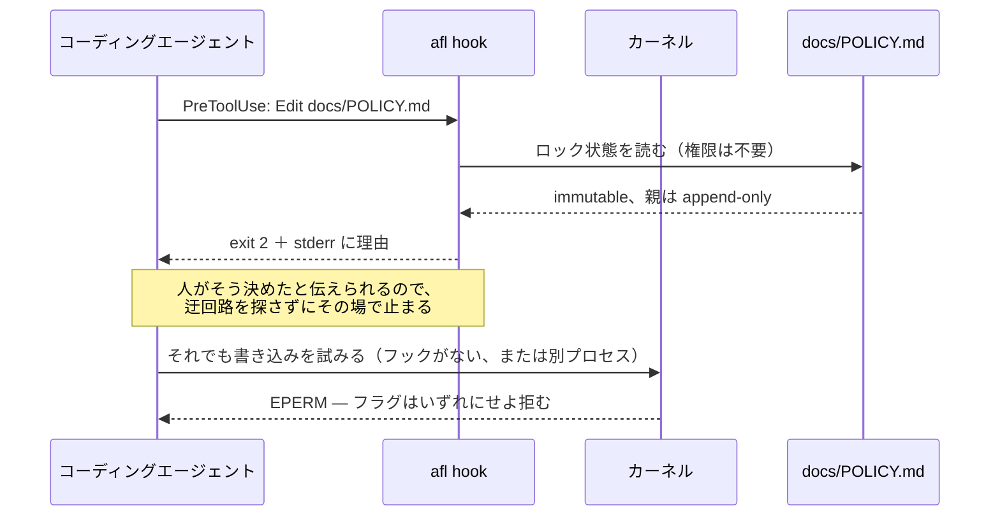
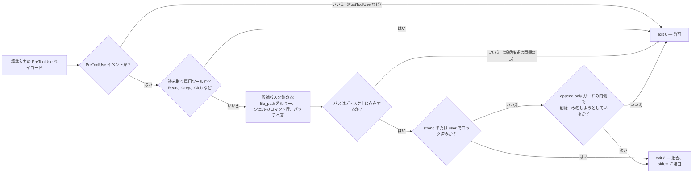
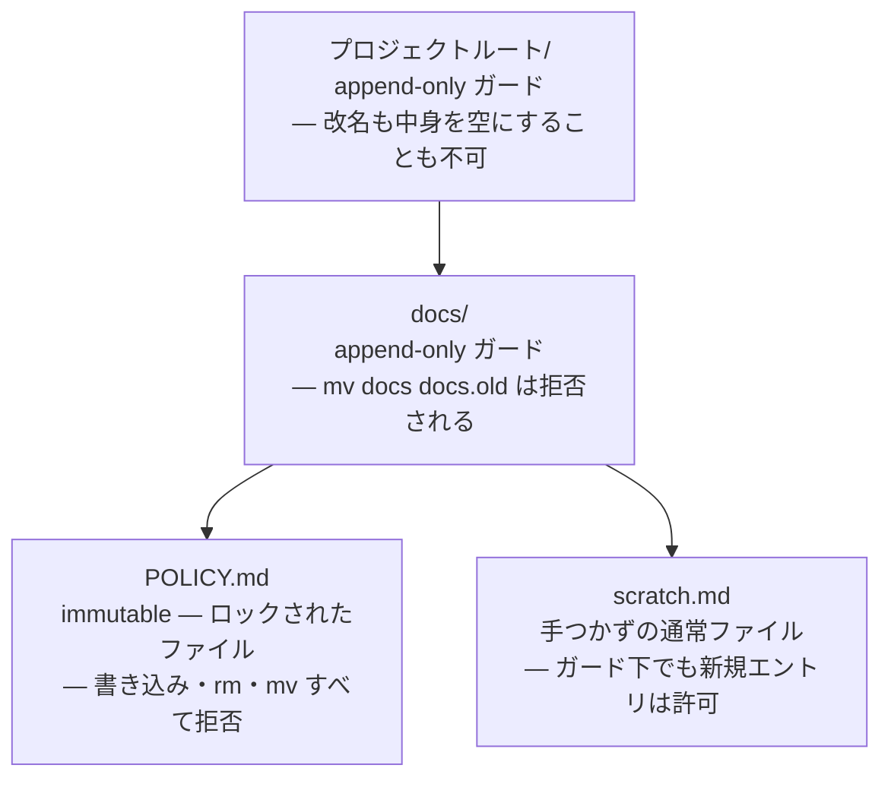

<p align="center">
  
</p>

<p align="center">
  <a href="README.md">English</a> ·
  <a href="README.ko.md">한국어</a> ·
  <a href="README.zh.md">中文</a> ·
  <b>日本語</b> ·
  <a href="README.de.md">Deutsch</a> ·
  <a href="README.fr.md">Français</a>
</p>

# agent-file-lock (`afl`)

## この道具が生まれた理由

リポジトリの中にあるドキュメントのいくつかは、実のところドキュメントではありません。それは
決定です。一度きちんと議論し、承認を得て、その後は意図的に手を触れないことにした内容です。
私たちのチームにもそうしたファイルが数点ありました。どれがそれに当たるかは全員が知っていて、
何か月も誰も触っていませんでした。

ところがある日、エージェントがそのうちの一つを書き換えました。ディレクトリを整理してほしいと
頼まれて、実際うまくやってのけたのです。見出しの言い回しを整え、段落を引き締め、残骸のように
見える一行を削りました。個々の編集はどれも、それだけを見れば筋が通っています。しかしそれらが
合わさって、人が意図をもって置いたルールを静かに書き換えてしまいました。その差分は、誰かが
十分に注意深く目を通すまで、しばらくブランチに残ったままでした。

居心地が悪かったのは、何も間違ったことは起きていない、という点でした。エージェントはどの
ルールも破っていません。エージェントに見えるルールなど、そもそも存在しなかったからです。
コントリビューションガイドの一文はお願いです。`CLAUDE.md` の一行もお願いです。`chmod a-w`
に至ってはそれ以下で、次のツール呼び出しは同じユーザー権限で走るので、元に戻したことすら
知らせずに解除できてしまいます。私たちが持っていたものはすべて助言であり、助言とは、役に
立とうと努める何かが真っ先に最適化して消してしまうものです。

だから保証は、エージェントの手が届かないところから来なければならず、同時に説明を伴わなければ
なりませんでした。この道具の考えはそれがすべてです。あなたの権限で動くいかなるものも届かない
場所にファイルを置き、それでも何かがそのファイルに手を伸ばしたときには、カーネルがやむを得ず
返す数値ではなく、人が書いたであろう一文で答えるということです。

## 何をする道具か

`afl` は、コーディングエージェント（またはあなたのユーザー権限で動く誰か）が決して変更しては
ならないファイルを固定します。カーネルの **immutable フラグ**を使い、Linux では `chattr +i`、
macOS では `chflags schg` に相当します。したがって、同じユーザーが簡単に元へ戻せる `chmod` と
違い、root 権限なしにこのロックは解除できません。ロックされたファイルは削除も名前の変更も
できないため、エディタやエージェントが好んで使う「一時ファイルに書いてから改名する」手口も
通用しません。

さらに、ロックを*迂回する*経路もふさぎます。親ディレクトリの名前を変えられるなら、その中の
ロック済みファイルは実質的に守られていません。`mv docs docs.locked && mkdir docs` を実行すると、
immutable な inode はそのまま残る一方で、そのパスは新しく作られた書き込み可能なファイルを
指すようになるからです。そこで `afl lock` は、プロジェクトルートまでさかのぼってすべての親
ディレクトリに **append-only**（追記のみ）の印を付けます。その中に新しいファイルを作ることは
引き続き可能ですが、ディレクトリ自身を含め、既に存在するものは削除も改名もできません。
[親ディレクトリのガード](#親ディレクトリのガード)を参照してください。

そして、自ら理由を説明します。カーネルが返せる答えは `EPERM` だけであり、
"Operation not permitted" を読んだエージェントは書き込みが失敗したことしか分からず、人が
そうあってはならないと決めたという事実は分かりません。先ほどの迂回策は、まさにこの地点で
考案されます。`afl hook` はツール呼び出しより前に走り、その呼び出しを言葉で拒みます。
[エージェントに理由を伝える](#エージェントに理由を伝える)を参照してください。

静的リンクされた単一の Go バイナリで、実行時の依存はありません（標準ライブラリのみを使います）。

| レベル | 仕組み | 同じユーザーが解除できる？ | 削除・改名を防ぐ？ |
|---|---|---|---|
| `strong`（既定） | Linux `FS_IMMUTABLE_FL`、macOS `SF_IMMUTABLE` | **できない**（root のみ） | **防ぐ** |
| `user` | `chmod a-w`（＋ macOS `UF_IMMUTABLE`） | できる | 防げない（Linux）／防ぐ（macOS） |
| 親ガード | Linux `FS_APPEND_FL`、macOS `SF_APPEND` | **できない**（root のみ） | **防ぐ**（追加は引き続き許可） |

## インストール

**Linux と macOS — このマシン向けのリリースバイナリをダウンロードします**

```sh
curl -fsSL https://raw.githubusercontent.com/Mineru98/agent-file-lock/main/install.sh | sh
```

**macOS — Homebrew cask（シェル補完も一緒に入ります）**

```sh
brew install Mineru98/tap/afl
```

**Go ツールチェインがあるすべてのプラットフォーム**

```sh
go install github.com/Mineru98/agent-file-lock/cmd/afl@latest
```

**ソースからビルド**

```sh
make build && cp bin/afl /usr/local/bin/
```

[`install.sh`](install.sh) は、お使いの OS とアーキテクチャに合う tarball を選び、リリースの
`checksums.txt` と照合して検証したうえで、`afl` を `/usr/local/bin` にインストールします。
そのディレクトリに実際に権限が要るときだけ `sudo` を使います。読み取る環境変数は三つで、
特定のタグを指定する `AFL_VERSION`、バイナリを別の場所に置く `AFL_BIN_DIR`、そして権限昇格の
代わりに失敗させる `AFL_NO_SUDO=1` です。

```sh
# シェルへ流し込む前に中身を読み、そのうえでバージョンと設置場所を固定します
curl -fsSL https://raw.githubusercontent.com/Mineru98/agent-file-lock/main/install.sh -o install.sh
AFL_VERSION=v0.1.5 AFL_BIN_DIR="$HOME/.local/bin" sh install.sh
```

linux/amd64、linux/arm64、darwin/amd64、darwin/arm64 向けのビルド済み tarball が、すべての
[リリース](https://github.com/Mineru98/agent-file-lock/releases)に添付されています。
スクリプトを一切走らせたくない場合は、`curl -fsSL <asset-url> | tar xzf - afl` でも構いません。

## アップデート

インストールしたのと同じ方法で更新してください。以下のコマンドはいずれも、その場でバイナリを
置き換えます。ほかにやり直すことはありません。フック設定は `PATH` 上の `afl` を名前で呼び出し、
ロックはファイル自体に付いたカーネルフラグなので、どちらも入れ替えの影響を受けません。

**Linux と macOS — インストールスクリプト**

```sh
# インストール時と同じコマンドで、既存のバイナリを上書きします
curl -fsSL https://raw.githubusercontent.com/Mineru98/agent-file-lock/main/install.sh | sh
```

**macOS — Homebrew cask**

```sh
brew update && brew upgrade --cask Mineru98/tap/afl
```

**Go ツールチェインがあるすべてのプラットフォーム**

```sh
go install github.com/Mineru98/agent-file-lock/cmd/afl@latest
```

**ソースからビルド**

```sh
git pull && make build && cp bin/afl /usr/local/bin/
```

そのうえで、いま動いているのがどのビルドかを確かめてください。新しいリリースが以前のものより
具合が悪いと分かったときは、タグを固定して戻すことができます。

```sh
afl version
curl -fsSL https://raw.githubusercontent.com/Mineru98/agent-file-lock/main/install.sh | AFL_VERSION=v0.1.4 sh
```

## 仕組み

守りは二層あり、二つは互いに逆の方向で働きます。実際に書き込みを止めるのはカーネルフラグで、
その理由を説明するのがフックです。どちらか一方だけでは隙間ができます。説明のないフラグは
迂回を招き、フラグのない説明はただの提案にとどまります。



`afl hook` は標準入力から届いたハーネスのペイロードを読み、そのツール呼び出しが作成・上書き・
移動・削除するすべてのパスを割り出し、システムコールが起きる前に答えを返します。何も書き込まず、
権限も必要としません。



ファイルを一つロックすると、その先祖ディレクトリにも印が付きます。これが「親を改名する」
迂回をふさぎます。ガードの掛かったディレクトリも新しいエントリは受け付けるので、ツリーは
普段どおり使えます。



## クイックスタート

先にファイルを書き、そのあとでロックしてください。カーネルフラグはあなたを含むすべての利用者に
対してそのファイルを書き込み不可にするため、まだ空のうちにロックしたファイルは、中身を入れる
ためにもう一度解除する必要があります。

```sh
mkdir -p docs
cat > docs/POLICY.md <<'EOF'
# Policy

Never commit credentials to this repository.
EOF

sudo afl lock docs/POLICY.md
```

これでファイルは immutable になり、プロジェクトルートまでのすべてのディレクトリが append-only
なので、ロックの下でパスをすり替えることもできません。

```sh
echo x >> docs/POLICY.md      # → Operation not permitted
rm docs/POLICY.md             # → Operation not permitted（解除するまで sudo でも不可）
mv docs docs.old              # → Operation not permitted（親ガード）
touch docs/scratch.md         # → 問題なし。ガードされた親も新規ファイルは受け付けます
```

続いてフックをインストールしてください。**このリポジトリでエージェントが作業するなら、この
手順を飛ばさないでください。** 自分で実行するまで何も登録されませんし、カーネルの応答だけを
頼りにするエージェントは `Operation not permitted` を、誰かが下した決定ではなく壊れた道具と
読みます。そしてまさにその時点から迂回路を探し始めます。エージェントごとに読む設定ファイルが
違うので、実際にお使いのものをインストールしてください。

```sh
afl hook install claude         # Claude Code — .claude/settings.json
afl hook install codex          # Codex      — .codex/hooks.json
afl hook install --all          # 両方
```

何かを書き込む前に、フックをどこへ入れるかを先に尋ねます。二つの答えが守る範囲が違うからです。
プロジェクト範囲はこのリポジトリを、ユーザー範囲はあなたが開くすべてのリポジトリを対象にします。
Enter を押すとプロジェクト範囲が選ばれます。

```
$ afl hook install claude
Where should the claude hook be installed?
  1) this project — /home/me/project/.claude/settings.json   (default)
  2) your user    — ~/.claude/settings.json, and every other repository
scope [1/2] (default 1):
[claude]       installed (/home/me/project/.claude/settings.json)

The hook refuses edits to locked paths before the tool runs and tells the
agent why. It needs no privileges. Verify with: afl hook check <locked path>
```

`--project` または `--user`（`--global` も同じフラグです）を渡せば先に答えられます。スクリプト
ではこれが必要で、標準入力が端末でない場合はそもそも尋ねずにプロジェクト範囲を使います。
インストールに root 権限は不要で、ファイルに既にある内容へ統合するだけです。実際に効いているか
確認してください。

```sh
afl hook check docs/POLICY.md   # exit 2 とともに拒否理由が平文で出力されます
```

ファイルを再び解放するには次のようにします。

```sh
sudo afl unlock docs/POLICY.md
```

## 使い方

```
afl lock   <path>...                  lock files + guard their parents (needs sudo for strong)
afl lock   -R <dir>                   every regular file beneath <dir>
afl lock   -f afl.yaml                everything listed in the config
afl unlock <path>... | -R <dir> | -f afl.yaml
afl status                            no path: scan this tree and list what is locked
afl status [-R] <path>... | -f afl.yaml
afl check  -f afl.yaml                exit 1 if anything drifted (CI / pre-commit; no root)
afl run    -f afl.yaml -- <cmd...>    unlock, run <cmd>, then always re-lock
afl hook                              PreToolUse guard for agents (stdin JSON, exit 2 = refused)
afl hook install claude|codex|--all   register the hook (asks: --project or --user)
afl hook check <path>...              the same verdict from any script (no root)
afl hook print claude|codex           the config snippet for that agent
afl doctor [<path>]                   OS, privileges, filesystem support, WSL detection
afl completion bash|zsh|fish
```

引数なしの `afl status` は、あなたが実際に知りたい問い、つまり「このあたりで何がロックされて
いるのか」に答えます。作業ディレクトリからツリーをたどる方式です。読み取りしかしないので権限は
不要で、リポジトリを大きくするだけでロックを持つことのない `.git` や `node_modules` などの
ディレクトリは飛ばします（`-a` で含められ、`--depth <n>` でたどる深さを制限できます）。

```
$ afl status
strong    docs/POLICY.md
guard     .
guard     docs/

1 locked, 2 guarded parents (412 files, 37 directories scanned under /home/me/project)
an agent is refused with: "The user has NOT authorized this agent to modify this file."
details: afl status <path>   ·   the full refusal: afl hook check <path>
```

フラグは次のとおりです。`-f/--config`、`-R/--recursive`、`--include-dirs`、`--dir-only`、
`--level strong|user`、`--exclude <glob>`（繰り返し指定でき、`**` に対応）、
`--follow-symlinks`、`-n/--dry-run`、`--fail-fast`、`--json`、`-q/--quiet`、
`--elevate`（sudo で再実行）、`--no-guard-parents`、`--guard-root <dir>`。`status` にはさらに
`-a/--all` と `--depth <n>` があります。

知っておくとよい決まりごとです。

- ディレクトリには `-R`（または `--dir-only`）が要ります。`afl lock docs` だけでは、案内とともに拒否されます。
- `-R` は通常ファイルのみを対象にします。ディレクトリの inode までロックするには `--include-dirs` を足しますが、その場合は中に新しいファイルを作ることも防がれます。
- シンボリックリンクは `--follow-symlinks` を付けない限り飛ばします。
- すべての変更は読み直して検証します。フラグを黙って無視するファイルシステムは失敗として報告します。
- 既にロック済み・解除済みの対象への操作は何もしません（exit 0）。
- 要求したエントリがすべて飛ばされた場合（たとえば保護対象のファイルがシンボリックリンクに置き換わっていた場合）、`lock` は exit 1 で終わり、`check` は見せかけの成功ではなくドリフトを報告します。
- `user` レベルのロックのあとの `unlock` は `u+w` だけを戻します。ロック時に落とした group／other の書き込みビットは戻りません（afl は元のモードを記録しません）。
- すべての変更は `O_NOFOLLOW` で開いたファイルディスクリプタ経由で行うため、検査と変更のあいだにパスの最終要素がシンボリックリンクへすり替わることはありません。

終了コード：`0` 正常 · `1` 一部失敗または `check` のドリフト検出 · `2` 使い方の誤り ·
`3` 権限不足 · `4` 未対応のファイルシステム。

## 親ディレクトリのガード

`docs/SSOT.md` をロックしてそこで止まると、守られるのは *inode* であって*パス*ではありません。
その上のディレクトリは改名でき、同じ場所に新しい `docs/SSOT.md` を作ることもできます。ロック
自体は無傷のまま残りますが、まったく無意味になります。

そこで `afl lock` は、ロックしたファイルごとに上へたどり、プロジェクトルートまでのすべての
ディレクトリに **append-only** フラグを設定します（Linux では `chattr +a`、macOS では
`chflags sappnd`）。するとカーネルは、それらのディレクトリについて次を拒みます。

- 既に中にあるものを削除、または改名すること（Linux の `may_delete()` と BSD の
  `ufs_rename()` はどちらもこのフラグを確認します）、および
- ディレクトリ自身の改名。対象の inode が append-only だからです。

新しいエントリを作ることは引き続き許されており、この点がこの方式を実用的にしています。
エージェントはどこにでもファイルを追加できますが、既にあるものを消せないだけです。immutable
フラグと同じく、これを解除するには root 権限が要ります。

```
project/            ← append-only        mv project elsewhere   → refused
├── docs/           ← append-only        mv docs docs.old       → refused
│   └── SSOT.md     ← immutable          write / rm / mv        → refused
└── src/            (untouched)          anything               → fine
```

- 境界は `-f <config>` が置かれたディレクトリ、なければ git ワークツリーのルート、それもなければ対象自身の親です。`--guard-root <dir>` で上書きできますが、`/`、`$HOME`、最上位ディレクトリは拒否されます。
- `--no-guard-parents` はこれを無効にし、迂回路を再び開きます。
- `afl unlock` は、その下にロックされたものが残っていない場合にだけガードを解除します。したがって、ファイルを一つ解除しても兄弟の保護までは外れません。
- 代償は確かにあるので知っておいてください。ガードが掛かっているあいだ、それらのディレクトリ内の*どの*エントリも削除・改名できません。`rm -rf project` は失敗し、最上位のファイルを一時ファイル＋改名で置き換える `git checkout` も失敗します。`sudo afl run -f afl.yaml -- git pull` はこれを扱えます（コマンドの実行中だけガードを解きます）。`--guard-root` で影響範囲を狭められます。
- Linux にはユーザーが解除できる append フラグがないため、`--level user` での親ガードは macOS／BSD のみで働きます。Linux ではその旨を報告して飛ばします。

## エージェントに理由を伝える

編集ツールから `EPERM` を受け取ったエージェントが知らされたのは、書き込みが失敗したという事実
だけです。人がそうあってはならないと決めた、ということは知らされておらず、この差が「障害を
報告する」と「障害を回避する道を探す」を分けます。

`afl hook` は PreToolUse のガードです。ツール呼び出しが実行される前にその内容を読み、ロック
済みのパスを変更・移動・削除しようとする呼び出しを、誰が禁じたのか、代わりに何をすべきかを
述べたメッセージとともに拒みます。

```
$ afl hook check docs/SSOT.md
BLOCKED by agent-file-lock (afl)

The user has NOT authorized this agent to modify this file.

  docs/SSOT.md — locked by the user (level: strong, attempted: modify)

These paths are locked at the kernel level (macOS schg / Linux chattr +i)
and their parent directories are append-only, so the usual workarounds are
closed too and are treated as a violation of the user's instruction:
  - renaming or replacing a parent directory to recreate the path
  - writing the content to a different path and calling it done
  - clearing the flag with chflags / chattr / sudo

If the change is genuinely required, stop and ask the user to unlock it:
  sudo afl --help        # then, once the user agrees:
  sudo afl unlock <path>
```

```sh
afl hook install claude         # 尋ねます: このプロジェクトか、ユーザー全体か
afl hook install claude --project
afl hook install claude --user  # ＝ --global。~/.claude/settings.json
afl hook install --all          # claude ＋ codex を一度の質問で
afl hook uninstall --all
```

権限は不要で、これは第一の防御線ではなく第二の防御線です。書き込みはいずれにせよカーネルが
拒みます。フックが足すのは、その理由です。

**どのエージェントに対応するか。** Claude Code がこのフックのプロトコルを定め、Codex がその
まま採用したので、一つのバイナリで両方に対応できます。`afl hook install claude` は
`.claude/settings.json` に、`afl hook install codex` は `.codex/hooks.json` に書き込みます。
どちらも既存の内容へ統合し、どちらも `hook uninstall` で取り外せます。`hook install` と
`hook print` が受け取る名前はこの二つだけです。ツール呼び出しの前にコマンドを実行できるその他の
ハーネスは、次の取り決めに合わせて手作業でつないでください。

| | |
|---|---|
| コマンド | `afl hook [--format auto\|json\|exit-code] [--strict] [<path>...]` |
| 標準入力 | ツール呼び出しを表す JSON。省略可能です |
| 終了コード | `0` 許可、`2` 拒否。許可のときは何も出力しません |
| 標準エラー | 拒否のとき、理由を平文で出力します |
| 標準出力 | 拒否のとき、理由を含む JSON オブジェクトを出力します。`hookSpecificOutput.permissionDecision`、`decision`/`reason`、`systemMessage` を同時に含めるので、一つの応答で複数のプロトコルを満たします |

ハーネスが 0 以外の終了コードを「フックの故障」と扱うなら `--format json` を、終了ステータス
しか見ないなら `--format exit-code` を使ってください。ハーネスが JSON を渡せない場合は、パスを
引数として渡せます。`afl hook check` がまさにその形であり、これにより git の pre-commit フック
からも使えます。

**何を見るか。** `tool_name`、`tool_input`、`cwd` に加え、ペイロードのどこにあっても
`file_path` / `path` / `target_file` / `source` / `destination` といったキー、あらゆる
`command` 文字列（シェルのコマンド行としてトークン化するので、`mv`、`rm`、`cp`、`tee`、
`sed -i`、`git checkout`、リダイレクト、`sudo chflags` をすべて認識します）、そしてあらゆる
パッチや unified diff の本文（`*** Update File:`、`+++ b/...`）を見ます。読み取り専用のツールと
コマンドは何も言わずに許可します。分類できないコマンドは、`--strict` を渡さない限りカーネルに
任せます。解析できないペイロードは決して遮りません。壊れた入力に対して遮る側へ倒れるフックは、
ハーネスを使い物にならなくしてしまうからです。

## 設定ファイル

`afl.yaml` を使います（同じスキーマの `afl.json` でも構いません）。相対パスは、そのファイルが
置かれたディレクトリを基準に解決されます。

```yaml
version: 1
level: strong
exclude:
  - "**/*.tmp"
paths:
  - docs/POLICY.md
  - path: docs/specs
    recursive: true
    include_dirs: false
  - path: README.md
    level: user
```

YAML パーサーは意図的に部分集合だけを扱います（マッピング、シーケンス、引用符ありなしのスカラー、
コメント）。アンカー、フロースタイル（`{}`/`[]`）、ブロックスカラー（`|`/`>`）、タグは行番号
付きで拒否されるので、それらが必要なら JSON をお使いください。
[`afl.yaml.example`](afl.yaml.example) を参照してください。

## git と併用する

git が追跡しているファイルをロックしておくと、上流でそれが変わったときに `git pull` や
`checkout` が失敗します。それこそが狙いです。更新するには次のようにします。

```sh
sudo afl run -f afl.yaml -- git pull
```

`afl run` は保護対象の集合を解除し、**親ガードも解放したうえで**コマンドを実行し、コマンドが
どう終わったかにかかわらず両方を元に戻します（コマンドの終了コードはそのまま渡され、再ロックに
失敗した場合は大きな警告とともに exit 1 になります）。`sudo` の下では、呼び出したユーザーの権限
（`SUDO_UID`/`SUDO_GID`）でコマンドを実行するため、`git pull` やエディタが root 所有のファイルを
作ることはありません。root のままにしたい場合は `--as-root` を渡します。手動のやり方も引き続き
使えます。

```sh
sudo afl unlock -f afl.yaml && git pull && sudo afl lock -f afl.yaml
```

pre-commit や CI では、`afl check -f afl.yaml` が root 権限なしで動き、ドリフトがあれば exit 1
で終わります。個々のパスについては `afl hook check <path>...` が同じ判定を返します。

## プラットフォーム別の注意

**Linux** — immutable フラグと append-only の親ガードのどちらにも `CAP_LINUX_IMMUTABLE` が
必要です（root は持っていますが、Docker の既定の capability 集合には**ありません**。
`docker run --cap-add LINUX_IMMUTABLE` を使ってください）。ext2/3/4、xfs、btrfs、f2fs、jfs で
対応しています。NFS、SMB、FAT/exFAT、overlayfs、FUSE、9p では対応していません。`afl doctor` が
`/proc/self/mountinfo` を読み、何かに触れる前に知らせてくれます。

**macOS** — `strong` は `schg` で、設定にも解除にも root が要ります。`user` は `uchg` を加えます。
親ガードは `sappnd`（root）、`--level user` では `uappnd` です。

**WSL** — WSL2 自身のファイルシステム（たとえば `~` の下の ext4）は Linux と同じように動きます。
`/mnt/c` などの DrvFs マウントは 9p でフラグを保持できないため、`afl` は exit 4 で終わり、
ファイルを Linux のファイルシステムへ移すよう案内します（`--level user` に下げる手もありますが、
DrvFs では `/etc/wsl.conf` で `metadata` を有効にしている場合にのみ働きます）。

**Windows ネイティブ**は対象外です。

## シェル補完

```sh
# bash（3.2 以上と互換）
afl completion bash > ~/.local/share/bash-completion/completions/afl
# zsh
afl completion zsh > "${fpath[1]}/_afl"        # 例: /usr/local/share/zsh/site-functions/_afl
# fish
afl completion fish > ~/.config/fish/completions/afl.fish
```

Homebrew では `$(brew --prefix)/etc/bash_completion.d/afl` と
`$(brew --prefix)/share/zsh/site-functions/_afl` です。

補足：`afl` という接頭辞は AFL ファザー（`afl-fuzz`、`afl-gcc`）と共通です。衝突はしませんが、
それを入れていると `afl<TAB>` で両方が並びます。

## ライセンス

MIT
