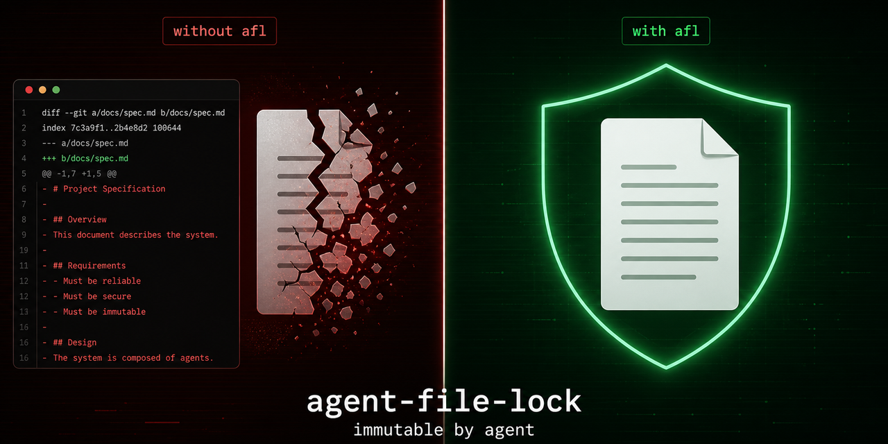
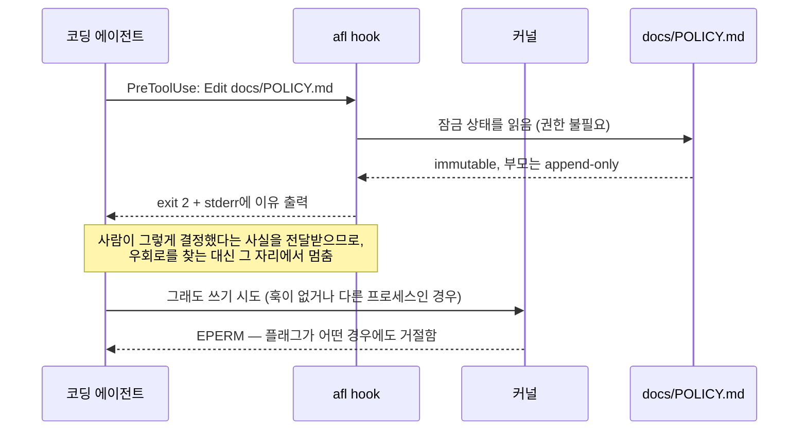
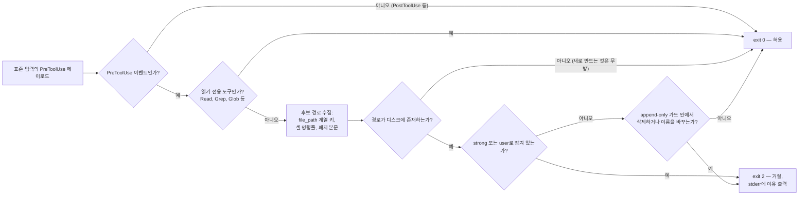
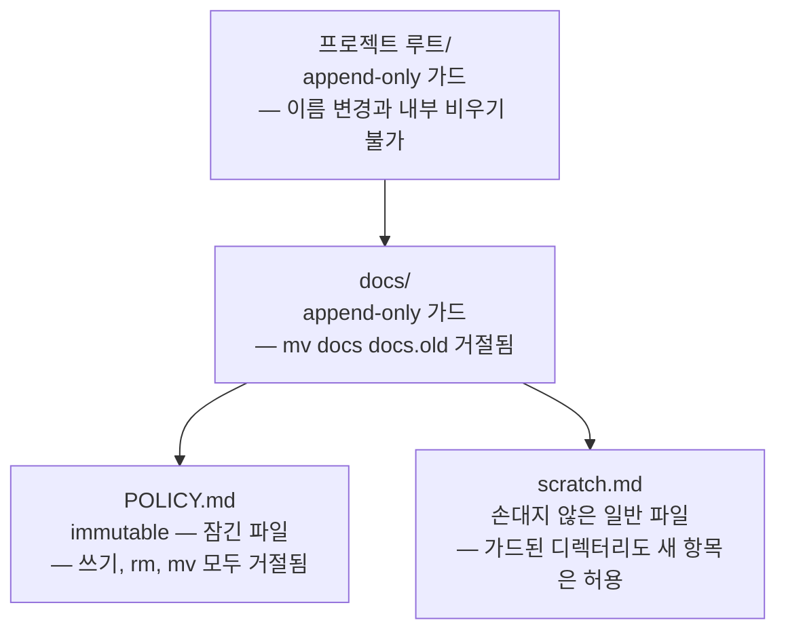

<p align="center">
  
</p>

<p align="center">
  <a href="README.md">English</a> ·
  <b>한국어</b> ·
  <a href="README.zh.md">中文</a> ·
  <a href="README.ja.md">日本語</a> ·
  <a href="README.de.md">Deutsch</a> ·
  <a href="README.fr.md">Français</a>
</p>

# agent-file-lock (`afl`)

## 이 도구를 만든 이유

저장소에 들어 있는 문서 가운데 일부는 사실 문서가 아닙니다. 그것들은 결정입니다.
한 번 충분히 논의했고, 승인을 받았으며, 그 뒤로는 의도적으로 건드리지 않기로 한
내용입니다. 저희 팀에도 그런 문서가 몇 개 있었습니다. 어떤 것이 거기에 해당하는지
모두가 알고 있었고, 몇 달 동안 아무도 손대지 않았습니다.

그러던 어느 날 에이전트가 그중 하나를 수정했습니다. 디렉터리를 정리해 달라는 요청을
받았고, 실제로 일을 잘 해냈습니다. 제목의 표현을 다듬었고, 한 문단을 간결하게 줄였으며,
남겨진 찌꺼기처럼 보이는 줄을 지웠습니다. 각각의 편집은 그것만 놓고 보면 모두 타당했습니다.
그러나 그 편집들이 모여서, 사람이 의도를 가지고 적어 놓은 규칙 하나를 조용히 다시
써 버렸습니다. 그리고 그 변경 사항은 아무도 자세히 들여다보기 전까지 한동안 브랜치에
그대로 남아 있었습니다.

불편했던 지점은, 잘못된 일이 벌어진 것이 아니라는 사실이었습니다. 에이전트는 어떤 규칙도
어기지 않았습니다. 에이전트가 볼 수 있는 규칙 자체가 없었기 때문입니다. 기여 안내서에
적어 둔 문구는 부탁입니다. `CLAUDE.md`에 써 놓은 한 줄도 부탁입니다. `chmod a-w`는
그보다 못한 수준인데, 다음 도구 호출이 동일한 사용자 권한으로 실행되므로 되돌렸다는
사실조차 알리지 않고 그대로 해제할 수 있기 때문입니다. 저희가 가진 수단은 전부 권고에
불과했고, 권고란 도움이 되려고 애쓰는 무언가가 가장 먼저 최적화해서 없애 버리는
대상입니다.

그래서 보장은 에이전트가 손댈 수 없는 곳에서 나와야 했고, 동시에 설명을 동반해야
했습니다. 이 도구의 발상은 그것이 전부입니다. 파일을 여러분의 권한으로 실행되는 그 어떤
것도 닿지 못하는 자리에 놓고, 그럼에도 무언가가 그 파일에 손을 뻗을 때는 커널이 어쩔 수
없이 내놓은 숫자 대신에 사람이 썼을 법한 문장으로 대답하게 만드는 것입니다.

## 무엇을 하는 도구인가

`afl`은 코딩 에이전트(또는 여러분의 사용자 권한으로 실행되는 누구든)가 절대 수정해서는
안 되는 파일을 고정합니다. 커널의 **immutable 플래그**를 사용하는데, Linux에서는
`chattr +i`이고 macOS에서는 `chflags schg`입니다. 따라서 동일한 사용자가 간단히
되돌릴 수 있는 `chmod`와 달리, 루트 권한 없이는 잠금을 해제할 수 없습니다. 잠긴 파일은
삭제하거나 이름을 바꾸는 것도 불가능하므로, 편집기와 에이전트가 즐겨 쓰는 "임시 파일에
쓴 다음 이름을 바꾸는" 방식도 통하지 않습니다.

또한 잠금을 *우회하는* 경로까지 막습니다. 부모 디렉터리의 이름을 바꿀 수 있다면 그 안의
잠긴 파일은 사실 보호받고 있다고 보기 어렵습니다. `mv docs docs.locked && mkdir docs`를
실행하면 immutable 상태인 아이노드는 그대로 남지만, 해당 경로는 새로 만들어진 쓰기 가능한
파일을 가리키게 되기 때문입니다. 그래서 `afl lock`은 프로젝트 루트까지 거슬러 올라가며
모든 부모 디렉터리에 **append-only** 표시를 남깁니다. 그 안에 새 파일을 만드는 것은 여전히
가능하지만, 디렉터리 자신을 포함해 이미 존재하는 항목은 삭제하거나 이름을 바꿀 수 없습니다.
[부모 디렉터리 가드](#부모-디렉터리-가드)를 참고하시기 바랍니다.

그리고 스스로 이유를 설명합니다. 커널이 내놓을 수 있는 대답은 `EPERM` 하나뿐이며,
"Operation not permitted"를 읽은 에이전트는 쓰기가 실패했다는 사실만 알게 될 뿐 사람이
그렇게 되어서는 안 된다고 결정했다는 사실은 알지 못합니다. 앞에서 이야기한 우회 방법이
바로 이 지점에서 고안됩니다. `afl hook`은 도구 호출보다 먼저 실행되어 그 호출을 말로
거절합니다. [에이전트에게 이유를 알려 주기](#에이전트에게-이유를-알려-주기)를 참고하시기
바랍니다.

정적으로 링크된 단일 Go 바이너리이며, 실행 시점의 의존성이 없습니다(표준 라이브러리만
사용합니다).

| 수준 | 방식 | 같은 사용자가 해제 가능? | 삭제·이름 변경 차단? |
|---|---|---|---|
| `strong` (기본값) | Linux `FS_IMMUTABLE_FL`, macOS `SF_IMMUTABLE` | **불가능** (루트만 가능) | **차단함** |
| `user` | `chmod a-w` (+ macOS `UF_IMMUTABLE`) | 가능 | 차단 못 함 (Linux) / 차단함 (macOS) |
| 부모 가드 | Linux `FS_APPEND_FL`, macOS `SF_APPEND` | **불가능** (루트만 가능) | **차단함** (추가는 계속 허용) |

## 설치

**Linux 및 macOS — 이 컴퓨터에 맞는 릴리스 바이너리를 내려받습니다**

```sh
curl -fsSL https://raw.githubusercontent.com/Mineru98/agent-file-lock/main/install.sh | sh
```

**macOS — Homebrew cask (셸 자동 완성까지 함께 설치됩니다)**

```sh
brew install Mineru98/tap/afl
```

**Go 툴체인이 있는 모든 플랫폼**

```sh
go install github.com/Mineru98/agent-file-lock/cmd/afl@latest
```

**소스에서 빌드**

```sh
make build && cp bin/afl /usr/local/bin/
```

[`install.sh`](install.sh)는 여러분의 운영체제와 아키텍처에 맞는 tarball을 고르고,
릴리스의 `checksums.txt`와 대조하여 검증한 다음, `afl`을 `/usr/local/bin`에
설치합니다. 그 디렉터리에 실제로 권한이 필요할 때에만 `sudo`를 사용합니다. 세 가지
환경 변수를 읽는데, 특정 태그를 지정하는 `AFL_VERSION`, 바이너리를 다른 곳에 두는
`AFL_BIN_DIR`, 그리고 권한을 올리는 대신 실패하도록 만드는 `AFL_NO_SUDO=1`입니다.

```sh
# 셸에 그대로 흘려 넣기 전에 내용을 읽어 본 다음, 버전과 설치 위치를 고정합니다
curl -fsSL https://raw.githubusercontent.com/Mineru98/agent-file-lock/main/install.sh -o install.sh
AFL_VERSION=v0.1.5 AFL_BIN_DIR="$HOME/.local/bin" sh install.sh
```

linux/amd64, linux/arm64, darwin/amd64, darwin/arm64용으로 미리 빌드한 tarball이 모든
[릴리스](https://github.com/Mineru98/agent-file-lock/releases)에 첨부되어 있습니다.
스크립트를 아예 실행하고 싶지 않으시다면 `curl -fsSL <asset-url> | tar xzf - afl`
방식도 동작합니다.

## 업데이트

설치한 방식과 같은 경로로 업데이트하시면 되며, 아래의 명령들은 모두 기존 바이너리를 그
자리에서 교체합니다. 그 밖에 다시 해야 하는 작업은 없습니다. 훅 설정은 `PATH`에 있는
`afl`을 이름으로 호출하고, 잠금은 파일 자체에 부여된 커널 플래그이기 때문에 두 가지 모두
바이너리 교체와 무관하게 그대로 유지됩니다.

**Linux 및 macOS — 설치 스크립트**

```sh
# 설치할 때와 같은 명령이며, 기존 바이너리를 덮어씁니다
curl -fsSL https://raw.githubusercontent.com/Mineru98/agent-file-lock/main/install.sh | sh
```

**macOS — Homebrew cask**

```sh
brew update && brew upgrade --cask Mineru98/tap/afl
```

**Go 툴체인이 있는 모든 플랫폼**

```sh
go install github.com/Mineru98/agent-file-lock/cmd/afl@latest
```

**소스에서 빌드**

```sh
git pull && make build && cp bin/afl /usr/local/bin/
```

그다음 현재 어떤 빌드를 쓰고 있는지 확인하시고, 새 릴리스가 이전 것보다 못하다고 판단되면
태그를 고정하여 이전 버전으로 되돌리실 수 있습니다.

```sh
afl version
curl -fsSL https://raw.githubusercontent.com/Mineru98/agent-file-lock/main/install.sh | AFL_VERSION=v0.1.4 sh
```

## 동작 방식

두 겹의 방어선이 있으며, 둘은 서로 반대 방향으로 작동합니다. 실제로 쓰기를 막는 것은 커널
플래그이고, 그 이유를 설명하는 것은 훅입니다. 둘 중 하나만 있으면 빈틈이 생깁니다. 설명이
없는 플래그는 우회를 부추기고, 플래그가 없는 설명은 그저 권유에 그칩니다.



`afl hook`은 표준 입력으로 들어온 하네스 페이로드를 읽고, 해당 도구 호출이 생성하거나
덮어쓰거나 이동하거나 삭제할 모든 경로를 파악한 다음, 시스템 호출이 일어나기 전에
답을 내놓습니다. 아무것도 쓰지 않으며 어떤 권한도 필요로 하지 않습니다.



파일 하나를 잠그면 그 조상 디렉터리에도 표시가 남으며, 이것이 부모 디렉터리의 이름을
바꾸는 우회를 막아 줍니다. 가드가 걸린 디렉터리도 새 항목은 계속 받아들이므로 트리를
평소처럼 사용하실 수 있습니다.



## 빠르게 시작하기

파일을 먼저 작성하고 그다음에 잠그시기 바랍니다. 커널 플래그는 여러분을 포함한 모든
사용자에게 그 파일을 쓸 수 없게 만들기 때문에, 아직 비어 있는 상태에서 잠근 파일은 내용을
채우기 위해 다시 해제해야 합니다.

```sh
mkdir -p docs
cat > docs/POLICY.md <<'EOF'
# Policy

Never commit credentials to this repository.
EOF

sudo afl lock docs/POLICY.md
```

이제 해당 파일은 immutable 상태이고 프로젝트 루트까지의 모든 디렉터리가 append-only이므로,
잠금 아래에서 경로를 바꿔치기하는 것도 불가능합니다.

```sh
echo x >> docs/POLICY.md      # → Operation not permitted
rm docs/POLICY.md             # → Operation not permitted (해제하기 전에는 sudo로도 불가)
mv docs docs.old              # → Operation not permitted (부모 가드)
touch docs/scratch.md         # → 정상 동작. 가드된 부모도 새 파일은 받아들입니다
```

그다음 훅을 설치하시기 바랍니다. **이 저장소에서 에이전트가 작업한다면 이 단계를 건너뛰지
마시기 바랍니다.** 직접 실행하기 전에는 아무것도 등록되지 않으며, 커널의 응답만 가지고
판단하는 에이전트는 `Operation not permitted`를 누군가 내린 결정이 아니라 고장 난 도구로
읽습니다. 그리고 바로 그때부터 우회로를 찾기 시작합니다. 에이전트마다 자기 설정 파일을
읽으므로, 실제로 사용하시는 것을 설치하시기 바랍니다.

```sh
afl hook install claude         # Claude Code — .claude/settings.json
afl hook install codex          # Codex      — .codex/hooks.json
afl hook install --all          # 둘 다
```

무엇이든 파일에 쓰기 전에 훅을 어디에 설치할지 먼저 묻는데, 두 가지 대답이 보호하는
범위가 서로 다르기 때문입니다. 프로젝트 범위는 이 저장소를 감당하고, 사용자 범위는
여러분이 여는 모든 저장소를 감당합니다. 엔터를 누르면 프로젝트 범위가 선택됩니다.

```
$ afl hook install claude
Where should the claude hook be installed?
  1) this project — /home/me/project/.claude/settings.json   (default)
  2) your user    — ~/.claude/settings.json, and every other repository
scope [1/2] (default 1):
[claude]       installed (/home/me/project/.claude/settings.json)

The hook refuses edits to locked paths before the tool runs and tells the
agent why. It needs no privileges. Verify with: afl hook check <locked path>
```

`--project`나 `--user`(`--global`도 같은 플래그입니다)를 넘기면 미리 대답할 수 있으며,
스크립트에서는 이 방식이 필요합니다. 표준 입력이 터미널이 아닌 경우에는 아예 묻지 않고
프로젝트 범위를 사용합니다. 설치에는 루트 권한이 필요하지 않고, 파일에 이미 들어 있는
내용에 병합할 뿐입니다. 실제로 적용되었는지 확인하시기 바랍니다.

```sh
afl hook check docs/POLICY.md   # exit 2와 함께 거절 사유가 평문으로 출력됩니다
```

파일을 다시 풀어 주려면 다음과 같이 실행합니다.

```sh
sudo afl unlock docs/POLICY.md
```

## 사용법

```
afl lock   <path>...                  lock files + guard their parents (needs sudo for strong)
afl lock   -R <dir>                   every regular file beneath <dir>
afl lock   -f afl.yaml                everything listed in the config
afl unlock <path>... | -R <dir> | -f afl.yaml
afl status                            no path: scan this tree and list what is locked
afl status [-R] <path>... | -f afl.yaml
afl check  -f afl.yaml                exit 1 if anything drifted (CI / pre-commit; no root)
afl run    -f afl.yaml -- <cmd...>    unlock, run <cmd>, then always re-lock
afl hook                              PreToolUse guard for agents (stdin JSON, exit 2 = refused)
afl hook install claude|codex|--all   register the hook (asks: --project or --user)
afl hook check <path>...              the same verdict from any script (no root)
afl hook print claude|codex           the config snippet for that agent
afl doctor [<path>]                   OS, privileges, filesystem support, WSL detection
afl completion bash|zsh|fish
```

인자 없이 실행한 `afl status`는 여러분이 실제로 궁금해하는 질문, 즉 "여기에서 무엇이
잠겨 있는가"에 답합니다. 작업 디렉터리부터 트리를 훑는 방식으로 동작합니다. 읽기만 하므로
권한이 필요 없고, 저장소의 크기만 키울 뿐 잠금이 걸릴 일은 없는 `.git`, `node_modules`
같은 디렉터리는 건너뜁니다(`-a`를 주면 포함하고, `--depth <n>`으로 탐색 깊이를 제한할 수
있습니다).

```
$ afl status
strong    docs/POLICY.md
guard     .
guard     docs/

1 locked, 2 guarded parents (412 files, 37 directories scanned under /home/me/project)
an agent is refused with: "The user has NOT authorized this agent to modify this file."
details: afl status <path>   ·   the full refusal: afl hook check <path>
```

플래그는 다음과 같습니다. `-f/--config`, `-R/--recursive`, `--include-dirs`,
`--dir-only`, `--level strong|user`, `--exclude <glob>`(반복 지정 가능하며 `**`를
지원합니다), `--follow-symlinks`, `-n/--dry-run`, `--fail-fast`, `--json`,
`-q/--quiet`, `--elevate`(sudo로 재실행합니다), `--no-guard-parents`,
`--guard-root <dir>`가 있고, `status`에는 `-a/--all`과 `--depth <n>`이 추가됩니다.

알아 두시면 좋은 규칙들입니다.

- 디렉터리에는 `-R`(또는 `--dir-only`)가 필요합니다. `afl lock docs`만 실행하면 안내 문구와 함께 거절됩니다.
- `-R`는 일반 파일만 대상으로 삼습니다. 디렉터리 아이노드까지 잠그려면 `--include-dirs`를 추가하시면 되는데, 이 경우 내부에 새 파일을 만드는 것도 막힙니다.
- 심볼릭 링크는 `--follow-symlinks`를 주지 않는 한 건너뜁니다.
- 모든 변경은 다시 읽어서 검증합니다. 플래그를 조용히 무시하는 파일 시스템은 실패로 보고합니다.
- 이미 잠겨 있거나 이미 풀려 있는 대상에 대한 작업은 아무 일도 하지 않고 종료합니다(exit 0).
- 요청한 항목이 전부 건너뛰어진 경우(예를 들어 보호 대상 파일이 심볼릭 링크로 바뀌어 있는 경우), `lock`은 exit 1로 끝나고 `check`는 겉으로만 성공한 결과 대신 이탈을 보고합니다.
- `user` 수준으로 잠근 뒤의 `unlock`은 `u+w`만 복원합니다. 잠금 과정에서 제거된 그룹·기타 쓰기 비트는 복원되지 않습니다(afl은 원래의 모드를 기록해 두지 않습니다).
- 모든 변경은 `O_NOFOLLOW`로 연 파일 서술자를 통해 이루어지므로, 검사 시점과 변경 시점 사이에 경로의 마지막 구성 요소가 심볼릭 링크로 바뀌는 일은 생기지 않습니다.

종료 코드는 다음과 같습니다. `0` 정상 · `1` 일부 실패 또는 `check`의 이탈 감지 ·
`2` 사용법 오류 · `3` 권한 부족 · `4` 지원하지 않는 파일 시스템입니다.

## 부모 디렉터리 가드

`docs/SSOT.md`를 잠그고 거기에서 멈추면 보호되는 것은 *아이노드*이지 *경로*가 아닙니다.
그 위의 디렉터리는 이름을 바꿀 수 있고, 그 자리에 새로운 `docs/SSOT.md`를 만들 수도
있습니다. 잠금 자체는 멀쩡하게 남아 있지만 아무런 의미가 없어집니다.

그래서 `afl lock`은 잠근 파일마다 위로 거슬러 올라가며 프로젝트 루트까지의 모든
디렉터리에 **append-only** 플래그를 설정합니다(Linux에서는 `chattr +a`,
macOS에서는 `chflags sappnd`입니다). 그러면 커널은 그 디렉터리들에 대해 다음을
거절합니다.

- 이미 안에 들어 있는 항목을 삭제하거나 이름을 바꾸는 작업(Linux의 `may_delete()`와
  BSD의 `ufs_rename()`이 모두 이 플래그를 확인합니다), 그리고
- 디렉터리 자신의 이름을 바꾸는 작업. 대상 아이노드가 append-only이기 때문입니다.

새 항목을 만드는 것은 여전히 허용되며, 바로 이 점이 이 방식을 실용적으로 만들어 줍니다.
에이전트는 어디에나 파일을 추가할 수 있고, 다만 이미 있는 것을 사라지게 만들지 못할 뿐입니다.
immutable 플래그와 마찬가지로 이 플래그를 해제하려면 루트 권한이 필요합니다.

```
project/            ← append-only        mv project elsewhere   → refused
├── docs/           ← append-only        mv docs docs.old       → refused
│   └── SSOT.md     ← immutable          write / rm / mv        → refused
└── src/            (untouched)          anything               → fine
```

- 경계는 `-f <config>`가 들어 있는 디렉터리이며, 그것이 없으면 git 워크트리 루트, 그것도 없으면 대상의 부모 디렉터리입니다. `--guard-root <dir>`로 덮어쓸 수 있으나 `/`, `$HOME`, 최상위 디렉터리는 거절됩니다.
- `--no-guard-parents`를 주면 이 기능이 꺼지고 우회 경로가 다시 열립니다.
- `afl unlock`은 그 아래에 잠긴 것이 더 이상 남아 있지 않을 때에만 가드를 해제하므로, 파일 하나를 푼다고 해서 형제 파일들의 보호가 함께 풀리지는 않습니다.
- 감수해야 하는 비용이 분명히 있으므로 알아 두시기 바랍니다. 가드가 걸려 있는 동안에는 그 디렉터리들 안의 *어떤* 항목도 삭제하거나 이름을 바꿀 수 없습니다. `rm -rf project`가 실패하고, 최상위 파일을 임시 파일 생성 후 이름 변경 방식으로 교체하는 `git checkout`도 실패합니다. `sudo afl run -f afl.yaml -- git pull`이 이 문제를 처리해 주며(명령이 실행되는 동안 가드를 잠시 풀어 줍니다), `--guard-root`로 영향 범위를 좁힐 수 있습니다.
- Linux에는 사용자가 해제할 수 있는 append 플래그가 없으므로, `--level user`에서의 부모 가드는 macOS와 BSD에서만 동작합니다. Linux에서는 그 사실을 보고하고 건너뜁니다.

## 에이전트에게 이유를 알려 주기

편집 도구에서 `EPERM`을 받은 에이전트가 전달받은 정보는 쓰기가 실패했다는 사실뿐입니다.
사람이 그렇게 되어서는 안 된다고 결정했다는 사실은 전달받지 못했으며, 이 차이가
"장애물을 보고한다"와 "장애물을 우회할 방법을 찾는다"를 가릅니다.

`afl hook`은 PreToolUse 단계의 가드입니다. 도구 호출이 실행되기 전에 그 내용을 읽고,
잠긴 경로를 수정하거나 이동하거나 삭제하려는 호출을 거절하면서 누가 그것을 금지했는지와
대신 무엇을 해야 하는지를 알려 줍니다.

```
$ afl hook check docs/SSOT.md
BLOCKED by agent-file-lock (afl)

The user has NOT authorized this agent to modify this file.

  docs/SSOT.md — locked by the user (level: strong, attempted: modify)

These paths are locked at the kernel level (macOS schg / Linux chattr +i)
and their parent directories are append-only, so the usual workarounds are
closed too and are treated as a violation of the user's instruction:
  - renaming or replacing a parent directory to recreate the path
  - writing the content to a different path and calling it done
  - clearing the flag with chflags / chattr / sudo

If the change is genuinely required, stop and ask the user to unlock it:
  sudo afl --help        # then, once the user agrees:
  sudo afl unlock <path>
```

```sh
afl hook install claude         # 묻습니다: 이 프로젝트인지, 사용자 전체인지
afl hook install claude --project
afl hook install claude --user  # = --global. ~/.claude/settings.json
afl hook install --all          # claude + codex를 한 번의 질문으로 처리합니다
afl hook uninstall --all
```

훅에는 권한이 필요하지 않으며, 이것은 첫 번째 방어선이 아니라 두 번째 방어선입니다.
쓰기는 어느 쪽이든 커널이 거절합니다. 훅이 더해 주는 것은 그 이유입니다.

**어떤 에이전트를 지원하는가.** Claude Code가 이 훅 규약을 정의했고 Codex가 그대로
채택했으므로, 하나의 바이너리가 양쪽을 모두 지원합니다. `afl hook install claude`는
`.claude/settings.json`에, `afl hook install codex`는 `.codex/hooks.json`에 씁니다.
둘 다 이미 있는 내용에 병합하며, `hook uninstall`로 제거할 수 있습니다. `hook install`과
`hook print`가 받는 이름은 이 두 가지가 전부입니다. 도구 호출 전에 명령을 실행할 수 있는
그 밖의 하네스는 아래의 규약에 맞추어 직접 연결하시면 됩니다.

| | |
|---|---|
| 명령 | `afl hook [--format auto\|json\|exit-code] [--strict] [<path>...]` |
| 표준 입력 | 도구 호출을 담은 JSON. 선택 사항입니다 |
| 종료 코드 | `0` 허용, `2` 거부. 허용할 때에는 아무것도 출력하지 않습니다 |
| 표준 오류 | 거부할 때 그 이유를 평문으로 출력합니다 |
| 표준 출력 | 거부할 때 이유를 담은 JSON 객체를 출력합니다. `hookSpecificOutput.permissionDecision`, `decision`/`reason`, `systemMessage`를 한꺼번에 담아서 여러 규약을 하나의 응답으로 만족시킵니다 |

하네스가 0이 아닌 종료 코드를 고장 난 훅으로 취급한다면 `--format json`을, 종료 상태만
읽는다면 `--format exit-code`를 사용하시기 바랍니다. 하네스가 JSON을 넘겨줄 수 없을
때에는 경로를 인자로 전달할 수 있는데, `afl hook check`가 바로 그 형태이며 이 덕분에
git pre-commit 훅에서도 사용할 수 있습니다.

**무엇을 살펴보는가.** `tool_name`, `tool_input`, `cwd`를 보고, 그 밖에도 페이로드
어디에 있든 `file_path` / `path` / `target_file` / `source` / `destination` 같은 키,
모든 `command` 문자열(셸 명령줄로 토큰화하므로 `mv`, `rm`, `cp`, `tee`, `sed -i`,
`git checkout`, 리다이렉션, `sudo chflags`를 모두 인식합니다), 그리고 패치나 통합 diff
본문(`*** Update File:`, `+++ b/...`)을 살펴봅니다. 읽기 전용 도구와 명령은 아무 말 없이
허용합니다. 분류할 수 없는 명령은 `--strict`를 주지 않는 한 커널에 맡기며, 해석할 수 없는
페이로드는 결코 차단하지 않습니다. 잘못된 입력에 대해 차단하는 쪽으로 실패하는 훅은
하네스를 쓸 수 없게 만들기 때문입니다.

## 설정 파일

`afl.yaml`을 사용합니다(같은 스키마의 `afl.json`도 가능합니다). 상대 경로는 그 파일이 있는
디렉터리를 기준으로 해석됩니다.

```yaml
version: 1
level: strong
exclude:
  - "**/*.tmp"
paths:
  - docs/POLICY.md
  - path: docs/specs
    recursive: true
    include_dirs: false
  - path: README.md
    level: user
```

YAML 파서는 의도적으로 부분 집합만 지원합니다(매핑, 시퀀스, 따옴표가 있거나 없는 스칼라,
주석을 지원합니다). 앵커, 플로 스타일(`{}`/`[]`), 블록 스칼라(`|`/`>`), 태그는 줄 번호와
함께 거절되므로, 그런 기능이 필요하시면 JSON을 사용하시기 바랍니다.
[`afl.yaml.example`](afl.yaml.example)을 참고하시기 바랍니다.

## git과 함께 사용하기

git이 추적하는 파일을 잠가 두면 원격에서 그 파일이 바뀌었을 때 `git pull`이나
`checkout`이 실패합니다. 그것이 바로 의도한 동작입니다. 업데이트하려면 다음과 같이
실행하시기 바랍니다.

```sh
sudo afl run -f afl.yaml -- git pull
```

`afl run`은 보호 대상 집합의 잠금을 풀고 **부모 가드까지 해제한 다음**, 명령을 실행하고,
명령이 어떻게 끝나든 그 뒤에 두 가지를 모두 복원합니다(명령의 종료 코드는 그대로
전달되며, 다시 잠그는 데 실패하면 큰 경고와 함께 exit 1이 됩니다). `sudo` 아래에서는
명령을 호출한 사용자 권한(`SUDO_UID`/`SUDO_GID`)으로 실행하므로 `git pull`이나 편집기가
루트 소유의 파일을 만들지 않습니다. 루트를 유지하려면 `--as-root`를 넘기시면 됩니다.
직접 하시는 편이 좋다면 수동 방식도 여전히 동작합니다.

```sh
sudo afl unlock -f afl.yaml && git pull && sudo afl lock -f afl.yaml
```

pre-commit이나 CI에서는 `afl check -f afl.yaml`이 루트 권한 없이 동작하며 이탈이
발견되면 exit 1로 끝납니다. 개별 경로에 대해서는 `afl hook check <path>...`가 같은
판정을 내려 줍니다.

## 플랫폼별 참고 사항

**Linux** — immutable 플래그와 append-only 부모 가드 모두 `CAP_LINUX_IMMUTABLE`이
필요합니다(루트는 가지고 있으나 Docker의 기본 capability 집합에는 **없습니다**.
`docker run --cap-add LINUX_IMMUTABLE`을 사용하시기 바랍니다). ext2/3/4, xfs, btrfs,
f2fs, jfs에서 지원되며 NFS, SMB, FAT/exFAT, overlayfs, FUSE, 9p에서는 지원되지 않습니다.
`afl doctor`가 `/proc/self/mountinfo`를 읽어서 무언가에 손대기 전에 알려 줍니다.

**macOS** — `strong`은 `schg`이며 설정과 해제 모두 루트 권한이 필요합니다. `user`는
`uchg`를 추가합니다. 부모 가드는 `sappnd`(루트)이거나 `--level user`에서는 `uappnd`입니다.

**WSL** — WSL2 자체의 파일 시스템(예를 들어 `~` 아래의 ext4)은 Linux와 동일하게
동작합니다. `/mnt/c`를 비롯한 DrvFs 마운트는 9p이므로 플래그를 담을 수 없으며, 이 경우
`afl`은 exit 4로 끝나면서 파일을 Linux 파일 시스템으로 옮기라고 안내합니다(또는
`--level user`로 물러설 수 있는데, DrvFs에서는 `/etc/wsl.conf`에 `metadata`가 켜져
있어야만 동작합니다).

**Windows 네이티브**는 지원 범위에 포함되지 않습니다.

## 셸 자동 완성

```sh
# bash (3.2 이상과 호환됩니다)
afl completion bash > ~/.local/share/bash-completion/completions/afl
# zsh
afl completion zsh > "${fpath[1]}/_afl"        # 예: /usr/local/share/zsh/site-functions/_afl
# fish
afl completion fish > ~/.config/fish/completions/afl.fish
```

Homebrew의 경로는 `$(brew --prefix)/etc/bash_completion.d/afl`과
`$(brew --prefix)/share/zsh/site-functions/_afl`입니다.

참고로 `afl`이라는 접두사는 AFL 퍼저(`afl-fuzz`, `afl-gcc`)와 겹칩니다. 서로 충돌하지는
않지만, 그 도구가 설치되어 있다면 `afl<TAB>`을 눌렀을 때 양쪽이 함께 나열됩니다.

## 라이선스

MIT
