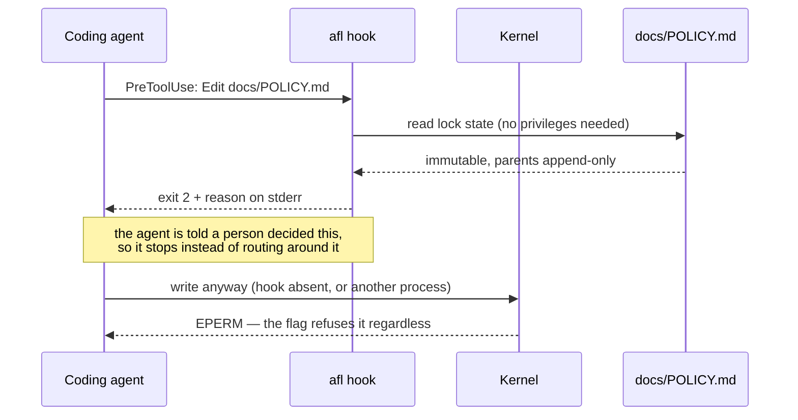
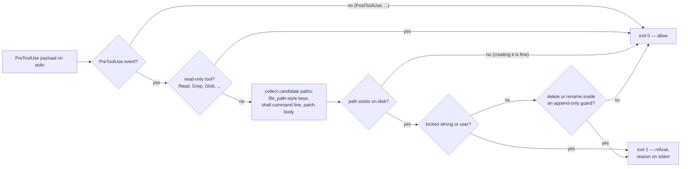
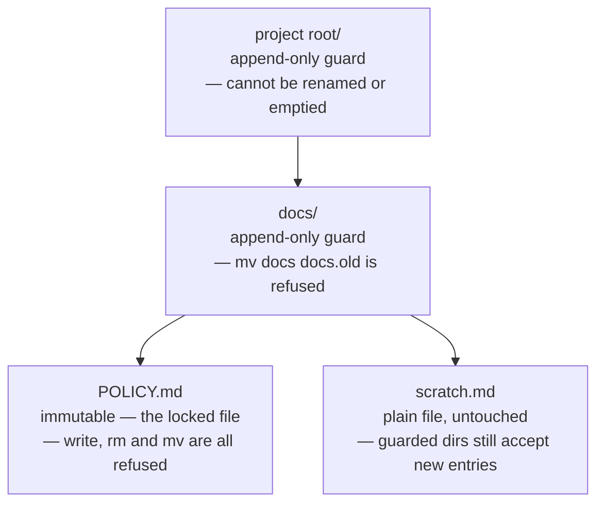

<p align="center">
  
</p>

# agent-file-lock (`afl`)

`afl` pins files that a coding agent (or anyone running as your user) must
never modify. It uses the kernel's **immutable flag** — `chattr +i` on Linux,
`chflags schg` on macOS — so the lock cannot be undone without root, unlike
`chmod`, which the same user can simply reverse. Locked files also cannot be
deleted or renamed, which defeats the "write to temp file then rename" trick
editors and agents use.

It also closes the way *around* the lock. A locked file whose parent directory
can be renamed is not really protected: `mv docs docs.locked && mkdir docs`
leaves the immutable inode untouched and makes the path resolve to a fresh,
writable file. So `afl lock` also marks every parent directory up to the
project root **append-only** — new files may still be created there, but
nothing existing can be deleted or renamed, including the directories
themselves. See [Parent guards](#parent-guards).

And it explains itself. The kernel can only answer `EPERM`; an agent that reads
"Operation not permitted" learns that a write failed, not that a human decided
it must not happen — which is how the workaround above gets invented. `afl
hook` runs before the tool call and refuses it in words. See
[Telling the agent](#telling-the-agent-why).

Single static Go binary. No runtime dependencies (stdlib only).

| Level | Mechanism | Same user can undo? | Blocks delete/rename? |
|---|---|---|---|
| `strong` (default) | Linux `FS_IMMUTABLE_FL`, macOS `SF_IMMUTABLE` | **No** (root only) | **Yes** |
| `user` | `chmod a-w` (+ macOS `UF_IMMUTABLE`) | Yes | No (Linux) / Yes (macOS) |
| parent guard | Linux `FS_APPEND_FL`, macOS `SF_APPEND` | **No** (root only) | **Yes** (adds are still allowed) |

## How it works

Two layers, and they fail in opposite directions. The kernel flag is what
actually stops the write; the hook is what explains it. Either one alone leaves
a gap: a flag with no explanation invites the workaround, and an explanation
with no flag is a suggestion.



`afl hook` reads the harness payload on stdin, works out every path the tool
call would create, overwrite, move or delete, and answers before the syscall
happens. It never writes anything and needs no privileges.



Locking one file marks its ancestors too, which is what closes the
rename-the-parent bypass. Guarded directories still accept new entries, so the
tree stays usable:



## Install

**Linux and macOS — download the release binary for this machine**

```sh
curl -fsSL https://raw.githubusercontent.com/Mineru98/agent-file-lock/main/install.sh | sh
```

**macOS — Homebrew cask (installs shell completions too)**

```sh
brew install Mineru98/tap/afl
```

**Any platform with a Go toolchain**

```sh
go install github.com/Mineru98/agent-file-lock/cmd/afl@latest
```

**From source**

```sh
make build && cp bin/afl /usr/local/bin/
```

[`install.sh`](install.sh) picks the tarball for your OS and architecture,
checks it against the release's `checksums.txt`, and installs `afl` into
`/usr/local/bin` — reaching for `sudo` only if that directory needs it. It
reads three variables: `AFL_VERSION` for a specific tag, `AFL_BIN_DIR` for
somewhere else to put the binary, and `AFL_NO_SUDO=1` to fail rather than
escalate.

```sh
# read it before you pipe it into a shell, then pin the version and the location
curl -fsSL https://raw.githubusercontent.com/Mineru98/agent-file-lock/main/install.sh -o install.sh
AFL_VERSION=v0.1.5 AFL_BIN_DIR="$HOME/.local/bin" sh install.sh
```

Prebuilt tarballs for linux/amd64, linux/arm64, darwin/amd64 and darwin/arm64 are
attached to every [release](https://github.com/Mineru98/agent-file-lock/releases),
so `curl -fsSL <asset-url> | tar xzf - afl` works too if you would rather not
run a script at all.

## Update

Update the way you installed — each command below replaces the binary in place.
Nothing else has to be redone: the hook config calls `afl` by name off your
`PATH`, and locks are kernel flags on the files themselves, so both survive the
swap untouched.

**Linux and macOS — the install script**

```sh
# same command as the install; it overwrites the existing binary
curl -fsSL https://raw.githubusercontent.com/Mineru98/agent-file-lock/main/install.sh | sh
```

**macOS — Homebrew cask**

```sh
brew update && brew upgrade --cask Mineru98/tap/afl
```

**Any platform with a Go toolchain**

```sh
go install github.com/Mineru98/agent-file-lock/cmd/afl@latest
```

**From source**

```sh
git pull && make build && cp bin/afl /usr/local/bin/
```

Then confirm which build you are on, and downgrade by pinning the tag if a
release turns out to be worse than the one it replaced:

```sh
afl version
curl -fsSL https://raw.githubusercontent.com/Mineru98/agent-file-lock/main/install.sh | AFL_VERSION=v0.1.4 sh
```

## Quick start

Write the file first and lock it second. The kernel flag makes the file
unwritable for everyone, you included, so a file locked while it is still empty
has to be unlocked again before it can be filled in.

```sh
mkdir -p docs
cat > docs/POLICY.md <<'EOF'
# Policy

Never commit credentials to this repository.
EOF

sudo afl lock docs/POLICY.md
```

The file is immutable now, and every directory up to the project root is
append-only, so the path cannot be swapped out from under the lock either:

```sh
echo x >> docs/POLICY.md      # → Operation not permitted
rm docs/POLICY.md             # → Operation not permitted (even with sudo, until unlocked)
mv docs docs.old              # → Operation not permitted (the parent guard)
touch docs/scratch.md         # → fine; guarded parents still accept new files
```

Then install the hook. **Do not skip this step if an agent works in this
repository.** Nothing is registered until you run it, and an agent that has
only the kernel to go on reads `Operation not permitted` as a broken tool
rather than as a decision somebody made, which is exactly when it starts
looking for a way around. Each agent reads its own config file, so install the
one you actually use:

```sh
afl hook install claude         # Claude Code — .claude/settings.json
afl hook install codex          # Codex      — .codex/hooks.json
afl hook install --all          # both
```

It asks where the hook belongs before writing anything, because the two
answers protect different things: the project scope covers this repository,
the user scope covers every repository you open. Pressing enter takes the
project.

```
$ afl hook install claude
Where should the claude hook be installed?
  1) this project — /home/me/project/.claude/settings.json   (default)
  2) your user    — ~/.claude/settings.json, and every other repository
scope [1/2] (default 1):
[claude]       installed (/home/me/project/.claude/settings.json)

The hook refuses edits to locked paths before the tool runs and tells the
agent why. It needs no privileges. Verify with: afl hook check <locked path>
```

Pass `--project` or `--user` (`--global` is the same flag) to answer in
advance, which is also what a script wants — a stdin that is not a terminal is
never asked and gets the project scope. Installing needs no root and only
merges into whatever the file already contains. Confirm that it took effect:

```sh
afl hook check docs/POLICY.md   # exit 2, and the refusal in plain text
```

Releasing the file again:

```sh
sudo afl unlock docs/POLICY.md
```

## Usage

```
afl lock   <path>...                  lock files + guard their parents (needs sudo for strong)
afl lock   -R <dir>                   every regular file beneath <dir>
afl lock   -f afl.yaml                everything listed in the config
afl unlock <path>... | -R <dir> | -f afl.yaml
afl status                            no path: scan this tree and list what is locked
afl status [-R] <path>... | -f afl.yaml
afl check  -f afl.yaml                exit 1 if anything drifted (CI / pre-commit; no root)
afl run    -f afl.yaml -- <cmd...>    unlock, run <cmd>, then always re-lock
afl hook                              PreToolUse guard for agents (stdin JSON, exit 2 = refused)
afl hook install claude|codex|--all   register the hook (asks: --project or --user)
afl hook check <path>...              the same verdict from any script (no root)
afl hook print [claude|codex|generic] the snippet, or the contract for anything else
afl doctor [<path>]                   OS, privileges, filesystem support, WSL detection
afl completion bash|zsh|fish
```

`afl status` with no arguments answers the question you actually have — what is
locked around here? — by scanning the tree from the working directory. It reads
only, so it needs no privileges, and it walks past `.git`, `node_modules` and
the other directories that make a repository large but never hold a lock (`-a`
includes them, `--depth <n>` bounds the walk).

```
$ afl status
strong    docs/POLICY.md
guard     .
guard     docs/

1 locked, 2 guarded parents (412 files, 37 directories scanned under /home/me/project)
an agent is refused with: "The user has NOT authorized this agent to modify this file."
details: afl status <path>   ·   the full refusal: afl hook check <path>
```

Flags: `-f/--config`, `-R/--recursive`, `--include-dirs`, `--dir-only`,
`--level strong|user`, `--exclude <glob>` (repeatable, `**` supported),
`--follow-symlinks`, `-n/--dry-run`, `--fail-fast`, `--json`, `-q/--quiet`,
`--elevate` (re-exec via sudo), `--no-guard-parents`, `--guard-root <dir>`,
and for `status`: `-a/--all`, `--depth <n>`.

Rules worth knowing:

- A directory needs `-R` (or `--dir-only`); `afl lock docs` alone is refused with a hint.
- `-R` targets regular files only. Add `--include-dirs` to lock directory inodes too, which also blocks creating new files inside.
- Symlinks are skipped unless `--follow-symlinks`.
- Every change is re-read and verified; a filesystem that silently ignores the flag is reported as a failure.
- Already-locked / already-unlocked targets are no-ops (exit 0).
- If every requested entry had to be skipped (for example a protected file was replaced by a symlink), `lock` exits 1 and `check` reports drift instead of a hollow success.
- `unlock` after a `user`-level lock restores `u+w` only; group/other write bits removed by the lock are not restored (afl keeps no record of the original mode).
- All mutations go through a file descriptor opened with `O_NOFOLLOW`, so the final path component cannot be swapped for a symlink between inspection and change.

Exit codes: `0` ok · `1` partial failure or `check` drift · `2` usage · `3` insufficient privileges · `4` unsupported filesystem.

## Parent guards

Locking `docs/SSOT.md` and stopping there protects an *inode*, not a *path*.
The directory above it can be renamed, and a new `docs/SSOT.md` created in its
place — the lock is still intact, and completely irrelevant.

So `afl lock` walks up from each locked file and sets the **append-only** flag
(`chattr +a` on Linux, `chflags sappnd` on macOS) on every directory up to the
project root. The kernel then refuses, for those directories:

- deleting or renaming anything already inside them (`may_delete()` on Linux,
  `ufs_rename()` on BSD both check the flag), and
- renaming the directory itself, because the victim inode is append-only.

Creating new entries is still allowed, which is what makes this usable: the
agent can add files anywhere, it just cannot make an existing one disappear.
Like the immutable flag, clearing it needs root.

```
project/            ← append-only        mv project elsewhere   → refused
├── docs/           ← append-only        mv docs docs.old       → refused
│   └── SSOT.md     ← immutable          write / rm / mv        → refused
└── src/            (untouched)          anything               → fine
```

- The boundary is the directory holding `-f <config>`, else the git worktree
  root, else the target's own parent. `--guard-root <dir>` overrides it;
  `/`, `$HOME` and top-level directories are refused.
- `--no-guard-parents` turns it off and reopens the bypass.
- `afl unlock` releases a guard only once nothing beneath it is locked any
  more, so unlocking one file never disarms its siblings' protection.
- The cost is real and worth knowing: while a guard is up, *no* entry in those
  directories can be deleted or renamed. `rm -rf project` fails, and a `git
  checkout` that replaces a top-level file via temp-file-plus-rename fails too.
  `sudo afl run -f afl.yaml -- git pull` handles that (it releases the guards
  for the duration of the command), and `--guard-root` narrows the blast
  radius.
- Linux has no user-clearable append flag, so `--level user` guards parents on
  macOS/BSD only; there it is reported and skipped.

## Telling the agent why

An agent that gets `EPERM` from its edit tool has been told a write failed. It
has not been told that a person decided it must not happen, and the difference
is what separates "report the obstacle" from "find a way around the obstacle".

`afl hook` is a PreToolUse guard: it reads the tool call before it runs, and
refuses the ones that would modify, move or delete a locked path with a message
that says who forbade it and what to do instead.

```
$ afl hook check docs/SSOT.md
BLOCKED by agent-file-lock (afl)

The user has NOT authorized this agent to modify this file.

  docs/SSOT.md — locked by the user (level: strong, attempted: modify)

These paths are locked at the kernel level (macOS schg / Linux chattr +i)
and their parent directories are append-only, so the usual workarounds are
closed too and are treated as a violation of the user's instruction:
  - renaming or replacing a parent directory to recreate the path
  - writing the content to a different path and calling it done
  - clearing the flag with chflags / chattr / sudo

If the change is genuinely required, stop and ask the user to unlock it:
  sudo afl --help        # then, once the user agrees:
  sudo afl unlock <path>
```

```sh
afl hook install claude         # asks: this project, or your user?
afl hook install claude --project
afl hook install claude --user  # = --global; ~/.claude/settings.json
afl hook install --all          # claude + codex, one question for both
afl hook print generic          # the contract for anything else
afl hook uninstall --all
```

It needs no privileges, and it is a second line of defence, not the first: the
kernel refuses the write either way. What the hook adds is the reason.

**Which agents.** Claude Code defined this hook protocol and Codex adopted it
unchanged, so one binary serves both. `afl hook install claude` writes
`.claude/settings.json`, `afl hook install codex` writes `.codex/hooks.json`,
both merging into whatever is already there and both removable with
`hook uninstall`. Those two names are the whole list `install` takes; `generic`
is not one of them, because there is no file to write. It is a name
`afl hook print` accepts to show the contract below, which is what any other
harness that can run a command before a tool call needs:

| | |
|---|---|
| command | `afl hook [--format auto\|json\|exit-code] [--strict] [<path>...]` |
| stdin | the tool call as JSON — optional |
| exit | `0` allow, `2` deny; nothing is printed when allowed |
| stderr | on deny, the reason as plain text |
| stdout | on deny, a JSON object carrying the reason under `hookSpecificOutput.permissionDecision`, `decision`/`reason` and `systemMessage` at once, so several protocols are satisfied by one response |

Use `--format json` if the harness treats a non-zero exit as a broken hook, and
`--format exit-code` if it only reads the exit status. Paths may be passed as
arguments when the harness cannot pipe JSON — which is also what
`afl hook check` is, and what makes it usable from a git pre-commit hook.

**What it looks at.** `tool_name`, `tool_input` and `cwd`, plus, anywhere in the
payload: keys like `file_path` / `path` / `target_file` / `source` /
`destination`, any `command` string (tokenised as a shell command line, so
`mv`, `rm`, `cp`, `tee`, `sed -i`, `git checkout`, redirections and
`sudo chflags` are all recognised), and any patch or unified-diff body
(`*** Update File:`, `+++ b/...`). Read-only tools and commands are allowed
without comment. A command it cannot classify is left to the kernel unless you
pass `--strict`, and an unparsable payload never blocks — a hook that fails
closed on malformed input would make the harness unusable.

## Config file

`afl.yaml` (or `afl.json` with the same schema). Relative paths resolve against the file's directory.

```yaml
version: 1
level: strong
exclude:
  - "**/*.tmp"
paths:
  - docs/POLICY.md
  - path: docs/specs
    recursive: true
    include_dirs: false
  - path: README.md
    level: user
```

The YAML parser is a deliberate subset (mappings, sequences, quoted/plain scalars,
comments). Anchors, flow style (`{}`/`[]`), block scalars (`|`/`>`) and tags are
rejected with a line number — use JSON if you need them. See
[`afl.yaml.example`](afl.yaml.example).

## Working with git

Locked files that git tracks make `git pull` / `checkout` fail when upstream
changes them. That is the point. To update:

```sh
sudo afl run -f afl.yaml -- git pull
```

`afl run` unlocks the protected set **and releases the parent guards**, runs the
command, then restores both afterwards regardless of how the command ends (its exit code is passed through; a failed
re-lock turns it into exit 1 with a loud warning). Under `sudo` the command is
run as the invoking user (`SUDO_UID`/`SUDO_GID`), so `git pull` or an editor does
not create root-owned files; pass `--as-root` to keep root. The manual form still
works if you prefer it:

```sh
sudo afl unlock -f afl.yaml && git pull && sudo afl lock -f afl.yaml
```

Pre-commit / CI: `afl check -f afl.yaml` needs no root and exits 1 on drift, and
`afl hook check <path>...` gives the same verdict for individual paths.

## Platform notes

**Linux** — needs `CAP_LINUX_IMMUTABLE` for both the immutable flag and the
append-only parent guard (root has it; Docker's default cap set does **not**:
`docker run --cap-add LINUX_IMMUTABLE`). Supported on ext2/3/4,
xfs, btrfs, f2fs, jfs. Not on NFS, SMB, FAT/exFAT, overlayfs, FUSE, or 9p.
`afl doctor` reads `/proc/self/mountinfo` and tells you before anything is touched.

**macOS** — `strong` = `schg`, root required to set and clear. `user` adds `uchg`.
Parent guards are `sappnd` (root) or `uappnd` at `--level user`.

**WSL** — WSL2's own filesystem (ext4, e.g. under `~`) works like Linux.
`/mnt/c` and other DrvFs mounts are 9p and cannot hold the flag; `afl` exits 4
and tells you to move the files into the Linux filesystem (or fall back to
`--level user`, which on DrvFs only works with `metadata` enabled in `/etc/wsl.conf`).

**Windows native** is out of scope.

## Shell completion

```sh
# bash (3.2+ compatible)
afl completion bash > ~/.local/share/bash-completion/completions/afl
# zsh
afl completion zsh > "${fpath[1]}/_afl"        # e.g. /usr/local/share/zsh/site-functions/_afl
# fish
afl completion fish > ~/.config/fish/completions/afl.fish
```

Homebrew: `$(brew --prefix)/etc/bash_completion.d/afl`, `$(brew --prefix)/share/zsh/site-functions/_afl`.

Note: the `afl` prefix is shared with the AFL fuzzer (`afl-fuzz`, `afl-gcc`).
They do not conflict, but `afl<TAB>` will list both if you have it installed.

## License

MIT
