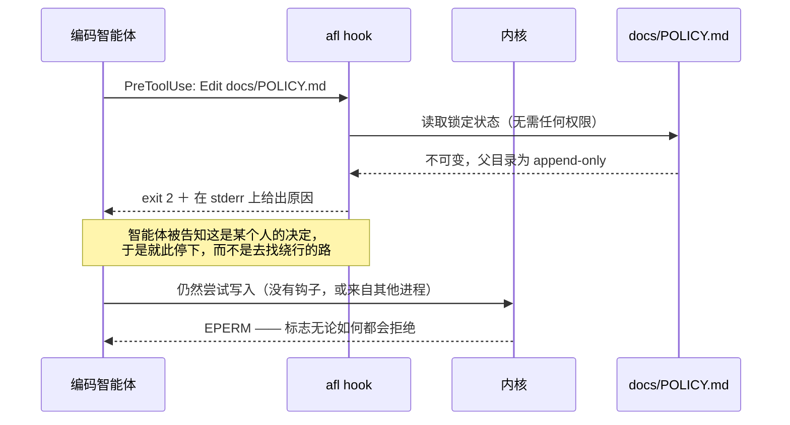
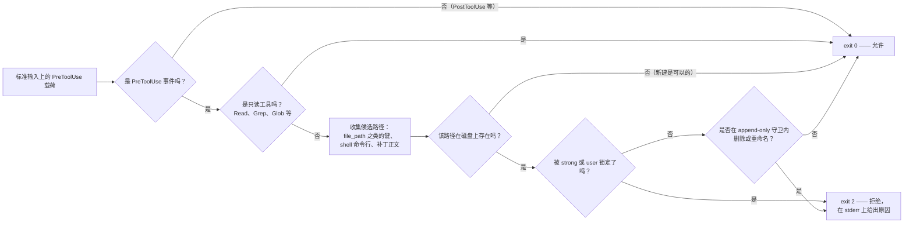
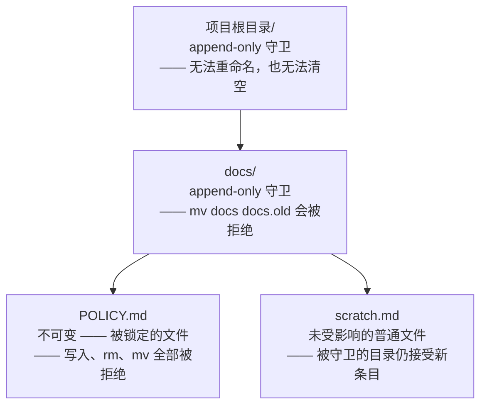

<p align="center">
  
</p>

<p align="center">
  <a href="README.md">English</a> ·
  <a href="README.ko.md">한국어</a> ·
  <b>中文</b> ·
  <a href="README.ja.md">日本語</a> ·
  <a href="README.de.md">Deutsch</a> ·
  <a href="README.fr.md">Français</a>
</p>

# agent-file-lock (`afl`)

## 为什么会有这个工具

仓库里有些文档其实并不是文档，而是决定：讨论过一次、签字确认，然后就被有意地放在那里不再
改动。我们团队就有几份这样的文件。谁都知道是哪几份，而且好几个月没有人碰过。

后来，一个智能体动了其中一份。它接到的任务是整理某个目录，而且做得不错：改写了一个标题，
精简了一个段落，删掉了一行看上去像是残留物的内容。单看每一处改动都说得过去。但它们合在
一起，悄悄改写了一条由人有意写下的规则，而这个 diff 在分支里躺了一阵子，才有人看得够仔细
并注意到。

真正让人不安的地方在于：并没有什么事情出错。智能体没有违反任何规则，因为它根本看不到任何
规则。贡献指南里的一句说明是请求，`CLAUDE.md` 里的一行也是请求，而 `chmod a-w` 连请求都
算不上——下一次工具调用以同一个用户身份运行，可以悄无声息地把它撤销。我们手里的全是建议，
而建议恰恰是一个努力想帮上忙的东西最先优化掉的东西。

所以，这份保证必须来自智能体够不到的地方，并且必须附带解释。这个工具的全部想法就在于此：
把文件放到任何以你的身份运行的东西都够不到的位置；而当有东西仍然伸手去碰它时，用一句人会
写下的话来回答，而不是内核不得不给出的一个错误码。

## 它做什么

`afl` 会钉住那些编码智能体（或任何以你的用户身份运行的程序）绝不能修改的文件。它使用内核的
**不可变标志**：在 Linux 上是 `chattr +i`，在 macOS 上是 `chflags schg`。因此，不同于同一个
用户就能轻易撤销的 `chmod`，没有 root 权限就无法解除这把锁。被锁定的文件同样无法删除或重命名，
这也让编辑器和智能体常用的“先写临时文件再改名”的手法失效。

它还堵住了*绕过*这把锁的路。如果父目录可以被重命名，那么其中被锁定的文件其实算不上受保护：
`mv docs docs.locked && mkdir docs` 并不会动到那个不可变的 inode，却让路径指向一个全新的、
可写的文件。因此 `afl lock` 还会一路向上，把直到项目根目录的每一级父目录标记为
**仅可追加（append-only）**：仍然可以在其中新建文件，但已经存在的东西（包括目录自身）都不能
被删除或重命名。参见[父目录守卫](#父目录守卫)。

而且它会自己解释原因。内核能给出的回答只有 `EPERM`；读到 “Operation not permitted” 的智能体
只知道一次写入失败了，并不知道是某个人决定它不该发生——上面那种绕行办法正是这样被想出来的。
`afl hook` 会在工具调用之前运行，并用语言把它拒绝掉。参见[把原因告诉智能体](#把原因告诉智能体)。

单个静态链接的 Go 二进制文件，运行时没有任何依赖（只用标准库）。

| 级别 | 机制 | 同一用户能撤销吗？ | 阻止删除／重命名？ |
|---|---|---|---|
| `strong`（默认） | Linux `FS_IMMUTABLE_FL`，macOS `SF_IMMUTABLE` | **不能**（仅 root） | **能** |
| `user` | `chmod a-w`（＋ macOS `UF_IMMUTABLE`） | 能 | 不能（Linux）／能（macOS） |
| 父目录守卫 | Linux `FS_APPEND_FL`，macOS `SF_APPEND` | **不能**（仅 root） | **能**（仍允许新增） |

## 安装

**Linux 和 macOS —— 下载适配本机的发行版二进制文件**

```sh
curl -fsSL https://raw.githubusercontent.com/Mineru98/agent-file-lock/main/install.sh | sh
```

**macOS —— Homebrew cask（同时安装 shell 补全）**

```sh
brew install Mineru98/tap/afl
```

**任何装有 Go 工具链的平台**

```sh
go install github.com/Mineru98/agent-file-lock/cmd/afl@latest
```

**从源码构建**

```sh
make build && cp bin/afl /usr/local/bin/
```

[`install.sh`](install.sh) 会挑选适配你的操作系统与架构的 tarball，用发行版的
`checksums.txt` 校验它，然后把 `afl` 安装到 `/usr/local/bin`，只有在该目录确实需要时才会
使用 `sudo`。它读取三个环境变量：指定某个标签的 `AFL_VERSION`、把二进制放到别处的
`AFL_BIN_DIR`，以及让脚本直接失败而不是提权的 `AFL_NO_SUDO=1`。

```sh
# 在把它管道送进 shell 之前先读一遍，然后固定版本和安装位置
curl -fsSL https://raw.githubusercontent.com/Mineru98/agent-file-lock/main/install.sh -o install.sh
AFL_VERSION=v0.1.5 AFL_BIN_DIR="$HOME/.local/bin" sh install.sh
```

每个[发行版](https://github.com/Mineru98/agent-file-lock/releases)都附带了面向
linux/amd64、linux/arm64、darwin/amd64 和 darwin/arm64 的预编译 tarball，所以如果你根本
不想运行脚本，`curl -fsSL <asset-url> | tar xzf - afl` 同样可行。

## 更新

按你当初的安装方式来更新即可，下面每条命令都会就地替换二进制文件。除此之外不需要重做任何
事情：钩子配置是按名字调用 `PATH` 上的 `afl`，而锁是文件本身携带的内核标志，因此两者都不会
受到这次替换的影响。

**Linux 和 macOS —— 安装脚本**

```sh
# 与安装时相同的命令，它会覆盖已有的二进制文件
curl -fsSL https://raw.githubusercontent.com/Mineru98/agent-file-lock/main/install.sh | sh
```

**macOS —— Homebrew cask**

```sh
brew update && brew upgrade --cask Mineru98/tap/afl
```

**任何装有 Go 工具链的平台**

```sh
go install github.com/Mineru98/agent-file-lock/cmd/afl@latest
```

**从源码构建**

```sh
git pull && make build && cp bin/afl /usr/local/bin/
```

之后确认你当前用的是哪个构建；如果某个新版本还不如它替换掉的那个，可以固定标签退回去：

```sh
afl version
curl -fsSL https://raw.githubusercontent.com/Mineru98/agent-file-lock/main/install.sh | AFL_VERSION=v0.1.4 sh
```

## 工作原理

一共两层，而且它们失效的方向正好相反。真正挡住写入的是内核标志，负责解释原因的是钩子。
只留其中一层就会留下缺口：没有解释的标志会引出绕行办法，而没有标志的解释只是一句建议。



`afl hook` 从标准输入读取宿主环境传来的载荷，算出这次工具调用会创建、覆盖、移动或删除的
每一个路径，并在系统调用发生之前给出答复。它不写入任何东西，也不需要任何权限。



锁定一个文件的同时也会标记它的各级父目录，这正是堵住“重命名父目录”这条绕行路的办法。被守卫的
目录仍然接受新条目，因此整棵目录树照常可用：



## 快速上手

先写文件，再上锁。内核标志会让这个文件对所有人都不可写，包括你自己，所以在文件还是空的时候
就锁上，之后还得先解锁才能把内容补上。

```sh
mkdir -p docs
cat > docs/POLICY.md <<'EOF'
# Policy

Never commit credentials to this repository.
EOF

sudo afl lock docs/POLICY.md
```

现在这个文件是不可变的，而且直到项目根目录的每一级目录都是 append-only，因此也无法在锁的
下方把路径整个换掉：

```sh
echo x >> docs/POLICY.md      # → Operation not permitted
rm docs/POLICY.md             # → Operation not permitted（解锁之前，即便用 sudo 也不行）
mv docs docs.old              # → Operation not permitted（父目录守卫）
touch docs/scratch.md         # → 正常；被守卫的父目录仍然接受新文件
```

接着安装钩子。**如果有智能体在这个仓库里工作，请不要跳过这一步。** 在你亲自运行之前不会注册
任何东西；而只能依据内核回应来判断的智能体，会把 `Operation not permitted` 读成工具坏了，
而不是某人做出的决定——那恰恰是它开始寻找绕行办法的时刻。每个智能体读取自己的配置文件，
所以请安装你实际使用的那一个：

```sh
afl hook install claude         # Claude Code — .claude/settings.json
afl hook install codex          # Codex      — .codex/hooks.json
afl hook install --all          # 两个都装
```

在写入任何文件之前，它会先询问钩子该装在哪里，因为两种答案保护的范围并不相同：项目范围覆盖
这一个仓库，用户范围覆盖你打开的每一个仓库。直接按回车会选择项目范围。

```
$ afl hook install claude
Where should the claude hook be installed?
  1) this project — /home/me/project/.claude/settings.json   (default)
  2) your user    — ~/.claude/settings.json, and every other repository
scope [1/2] (default 1):
[claude]       installed (/home/me/project/.claude/settings.json)

The hook refuses edits to locked paths before the tool runs and tells the
agent why. It needs no privileges. Verify with: afl hook check <locked path>
```

传入 `--project` 或 `--user`（`--global` 是同一个标志）可以提前作答，脚本里也正需要这样：
当标准输入不是终端时根本不会发问，直接采用项目范围。安装不需要 root 权限，而且只会并入文件
里已有的内容。请确认它确实生效了：

```sh
afl hook check docs/POLICY.md   # exit 2，并以纯文本给出拒绝理由
```

重新释放这个文件：

```sh
sudo afl unlock docs/POLICY.md
```

## 用法

```
afl lock   <path>...                  lock files + guard their parents (needs sudo for strong)
afl lock   -R <dir>                   every regular file beneath <dir>
afl lock   -f afl.yaml                everything listed in the config
afl unlock <path>... | -R <dir> | -f afl.yaml
afl status                            no path: scan this tree and list what is locked
afl status [-R] <path>... | -f afl.yaml
afl check  -f afl.yaml                exit 1 if anything drifted (CI / pre-commit; no root)
afl run    -f afl.yaml -- <cmd...>    unlock, run <cmd>, then always re-lock
afl hook                              PreToolUse guard for agents (stdin JSON, exit 2 = refused)
afl hook install claude|codex|--all   register the hook (asks: --project or --user)
afl hook check <path>...              the same verdict from any script (no root)
afl hook print claude|codex           the config snippet for that agent
afl doctor [<path>]                   OS, privileges, filesystem support, WSL detection
afl completion bash|zsh|fish
```

不带参数的 `afl status` 回答的是你真正关心的问题——这附近有哪些东西被锁住了？它从当前工作
目录开始扫描目录树。因为只做读取，所以不需要权限；同时会跳过 `.git`、`node_modules` 这类
只会让仓库变大、却绝不会持有锁的目录（`-a` 可以把它们包含进来，`--depth <n>` 可以限制扫描
深度）。

```
$ afl status
strong    docs/POLICY.md
guard     .
guard     docs/

1 locked, 2 guarded parents (412 files, 37 directories scanned under /home/me/project)
an agent is refused with: "The user has NOT authorized this agent to modify this file."
details: afl status <path>   ·   the full refusal: afl hook check <path>
```

可用标志：`-f/--config`、`-R/--recursive`、`--include-dirs`、`--dir-only`、
`--level strong|user`、`--exclude <glob>`（可重复，支持 `**`）、`--follow-symlinks`、
`-n/--dry-run`、`--fail-fast`、`--json`、`-q/--quiet`、`--elevate`（通过 sudo 重新执行）、
`--no-guard-parents`、`--guard-root <dir>`；`status` 另有 `-a/--all` 和 `--depth <n>`。

一些值得知道的规则：

- 目录需要 `-R`（或 `--dir-only`）；只写 `afl lock docs` 会被拒绝，并给出提示。
- `-R` 只作用于普通文件。加上 `--include-dirs` 才会同时锁定目录 inode，那样也会阻止在其中新建文件。
- 除非指定 `--follow-symlinks`，否则跳过符号链接。
- 每一次改动都会重新读取并验证；若某个文件系统默默忽略了标志，会被报告为失败。
- 对已锁定／已解锁的目标执行操作不会产生任何变化（exit 0）。
- 如果请求的条目全部只能跳过（例如受保护的文件被换成了符号链接），`lock` 以 exit 1 结束，而 `check` 会报告偏移，而不是给出一个空洞的成功。
- 在 `user` 级别的锁之后执行 `unlock` 只恢复 `u+w`；上锁时移除的 group／other 写位不会恢复（afl 不会记录原有的权限模式）。
- 所有修改都通过以 `O_NOFOLLOW` 打开的文件描述符进行，因此路径的最后一段不会在检查与修改之间被换成符号链接。

退出码：`0` 正常 · `1` 部分失败或 `check` 发现偏移 · `2` 用法错误 · `3` 权限不足 ·
`4` 文件系统不支持。

## 父目录守卫

只锁定 `docs/SSOT.md` 而就此打住，保护的是一个 *inode*，而不是一条*路径*。它上面的目录可以被
重命名，然后在原处新建一个 `docs/SSOT.md`——锁依旧完好，却完全失去了意义。

因此 `afl lock` 会从每个被锁定的文件向上走，并给直到项目根目录的每一级目录设置**仅可追加**
标志（Linux 上是 `chattr +a`，macOS 上是 `chflags sappnd`）。此后内核会对这些目录拒绝：

- 删除或重命名其中已有的任何条目（Linux 的 `may_delete()` 与 BSD 的 `ufs_rename()` 都会检查
  这个标志），以及
- 重命名目录自身，因为目标 inode 是 append-only 的。

新建条目仍然被允许，而这正是这套做法可用的原因：智能体可以在任何地方添加文件，只是没法让一个
已经存在的东西消失。和不可变标志一样，清除它需要 root 权限。

```
project/            ← append-only        mv project elsewhere   → refused
├── docs/           ← append-only        mv docs docs.old       → refused
│   └── SSOT.md     ← immutable          write / rm / mv        → refused
└── src/            (untouched)          anything               → fine
```

- 边界是存放 `-f <config>` 的目录；没有的话就是 git worktree 根目录；再没有就是目标自身的父目录。`--guard-root <dir>` 可以覆盖它，但 `/`、`$HOME` 和顶层目录会被拒绝。
- `--no-guard-parents` 会关掉它，也就重新打开了那条绕行路。
- 只有当某个守卫之下不再有任何锁定项时，`afl unlock` 才会释放该守卫，所以解锁一个文件绝不会顺带解除其同级文件的保护。
- 代价是实实在在的，值得事先知道：只要守卫还在，这些目录里的*任何*条目都不能被删除或重命名。`rm -rf project` 会失败，用“临时文件加改名”的方式替换顶层文件的 `git checkout` 也会失败。`sudo afl run -f afl.yaml -- git pull` 能处理这种情况（它在命令执行期间释放守卫），而 `--guard-root` 可以缩小影响范围。
- Linux 没有可由普通用户清除的 append 标志，因此 `--level user` 下的父目录守卫只在 macOS／BSD 上生效；在 Linux 上会被报告并跳过。

## 把原因告诉智能体

从编辑工具那里收到 `EPERM` 的智能体，得到的信息是“一次写入失败了”。它并没有被告知“有个人决定
这件事不能发生”，而这一差别，正是“报告障碍”与“绕过障碍”的分水岭。

`afl hook` 是一个 PreToolUse 守卫：它在工具调用运行之前读取这次调用，并拒绝那些会修改、移动或
删除被锁定路径的调用，同时给出一条说明——是谁禁止的，以及应该改做什么。

```
$ afl hook check docs/SSOT.md
BLOCKED by agent-file-lock (afl)

The user has NOT authorized this agent to modify this file.

  docs/SSOT.md — locked by the user (level: strong, attempted: modify)

These paths are locked at the kernel level (macOS schg / Linux chattr +i)
and their parent directories are append-only, so the usual workarounds are
closed too and are treated as a violation of the user's instruction:
  - renaming or replacing a parent directory to recreate the path
  - writing the content to a different path and calling it done
  - clearing the flag with chflags / chattr / sudo

If the change is genuinely required, stop and ask the user to unlock it:
  sudo afl --help        # then, once the user agrees:
  sudo afl unlock <path>
```

```sh
afl hook install claude         # 会询问：只针对这个项目，还是你的整个用户？
afl hook install claude --project
afl hook install claude --user  # ＝ --global；~/.claude/settings.json
afl hook install --all          # claude ＋ codex，一次询问同时处理
afl hook uninstall --all
```

它不需要任何权限，而且它是第二道防线而非第一道：无论如何，写入都会被内核拒绝。钩子补上的
是原因。

**支持哪些智能体。** Claude Code 定义了这套钩子协议，Codex 原样采用，因此一个二进制文件即可
服务两者。`afl hook install claude` 写入 `.claude/settings.json`，`afl hook install codex`
写入 `.codex/hooks.json`，两者都会并入文件中已有的内容，也都可以用 `hook uninstall` 移除。
`hook install` 和 `hook print` 接受的名字就只有这两个。任何其他能在工具调用前执行命令的宿主
环境，都可以照着下面这份约定手工接入：

| | |
|---|---|
| 命令 | `afl hook [--format auto\|json\|exit-code] [--strict] [<path>...]` |
| 标准输入 | 以 JSON 表示的工具调用——可选 |
| 退出码 | `0` 允许，`2` 拒绝；允许时不输出任何内容 |
| 标准错误 | 拒绝时，以纯文本给出原因 |
| 标准输出 | 拒绝时，输出一个携带原因的 JSON 对象，同时包含 `hookSpecificOutput.permissionDecision`、`decision`/`reason` 和 `systemMessage`，从而用一次响应满足多种协议 |

如果宿主环境把非零退出码当作钩子出错，请使用 `--format json`；如果它只读取退出状态，请使用
`--format exit-code`。当宿主环境无法通过管道传入 JSON 时，也可以把路径作为参数传递——
`afl hook check` 正是这种形式，这也让它可以用在 git 的 pre-commit 钩子里。

**它会看哪些内容。** `tool_name`、`tool_input` 和 `cwd`，此外还包括载荷中任何位置出现的
`file_path` / `path` / `target_file` / `source` / `destination` 之类的键、任何 `command`
字符串（会按 shell 命令行做词法解析，因此 `mv`、`rm`、`cp`、`tee`、`sed -i`、`git checkout`、
重定向以及 `sudo chflags` 都能被识别），以及任何补丁或 unified diff 正文
（`*** Update File:`、`+++ b/...`）。只读的工具和命令会被直接放行，不作声张。对于无法归类的
命令，除非你传入 `--strict`，否则交给内核处理；而无法解析的载荷绝不会被拦截——一个在输入格式
错误时倾向于拦截的钩子，会让整个宿主环境没法用。

## 配置文件

`afl.yaml`（或使用相同 schema 的 `afl.json`）。相对路径以该文件所在目录为基准解析。

```yaml
version: 1
level: strong
exclude:
  - "**/*.tmp"
paths:
  - docs/POLICY.md
  - path: docs/specs
    recursive: true
    include_dirs: false
  - path: README.md
    level: user
```

这个 YAML 解析器是有意为之的子集（映射、序列、带引号或不带引号的标量、注释）。锚点、流式写法
（`{}`/`[]`）、块标量（`|`/`>`）和标签都会带着行号被拒绝——如果你需要这些，请改用 JSON。
参见 [`afl.yaml.example`](afl.yaml.example)。

## 与 git 配合使用

当上游修改了被 git 跟踪且已锁定的文件时，`git pull` / `checkout` 会失败。这正是目的所在。
要更新，请执行：

```sh
sudo afl run -f afl.yaml -- git pull
```

`afl run` 会解锁受保护的集合**并释放父目录守卫**，运行命令，然后无论命令如何结束都恢复这两者
（命令的退出码会被透传；如果重新上锁失败，则以 exit 1 结束并给出醒目的警告）。在 `sudo` 之下，
命令会以调用者的身份运行（`SUDO_UID`/`SUDO_GID`），因此 `git pull` 或编辑器不会创建归 root
所有的文件；传入 `--as-root` 可以保持 root 身份。如果你更喜欢手动方式，它依然可用：

```sh
sudo afl unlock -f afl.yaml && git pull && sudo afl lock -f afl.yaml
```

pre-commit ／ CI：`afl check -f afl.yaml` 不需要 root 权限，发现偏移时以 exit 1 结束；
`afl hook check <path>...` 则对单个路径给出同样的判定。

## 平台说明

**Linux** —— 不可变标志与 append-only 父目录守卫都需要 `CAP_LINUX_IMMUTABLE`（root 拥有它，
但 Docker 的默认 capability 集合**没有**：请用 `docker run --cap-add LINUX_IMMUTABLE`）。
在 ext2/3/4、xfs、btrfs、f2fs、jfs 上受支持；在 NFS、SMB、FAT/exFAT、overlayfs、FUSE 或 9p
上不受支持。`afl doctor` 会读取 `/proc/self/mountinfo`，在动任何东西之前先告诉你。

**macOS** —— `strong` 即 `schg`，设置和清除都需要 root。`user` 会额外加上 `uchg`。父目录守卫
是 `sappnd`（root），在 `--level user` 下则是 `uappnd`。

**WSL** —— WSL2 自身的文件系统（例如 `~` 下的 ext4）与 Linux 表现一致。`/mnt/c` 及其他 DrvFs
挂载点是 9p，无法承载该标志；此时 `afl` 以 exit 4 结束，并提示你把文件移到 Linux 文件系统里
（或退回到 `--level user`，而它在 DrvFs 上只有在 `/etc/wsl.conf` 中启用了 `metadata` 时才有效）。

**原生 Windows** 不在支持范围内。

## Shell 补全

```sh
# bash（兼容 3.2 及以上）
afl completion bash > ~/.local/share/bash-completion/completions/afl
# zsh
afl completion zsh > "${fpath[1]}/_afl"        # 例如 /usr/local/share/zsh/site-functions/_afl
# fish
afl completion fish > ~/.config/fish/completions/afl.fish
```

Homebrew：`$(brew --prefix)/etc/bash_completion.d/afl`、
`$(brew --prefix)/share/zsh/site-functions/_afl`。

注意：`afl` 这个前缀与 AFL 模糊测试工具（`afl-fuzz`、`afl-gcc`）相同。它们并不冲突，但如果你
装了那套工具，按 `afl<TAB>` 时两边都会被列出来。

## 许可证

MIT
